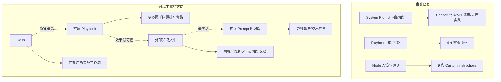
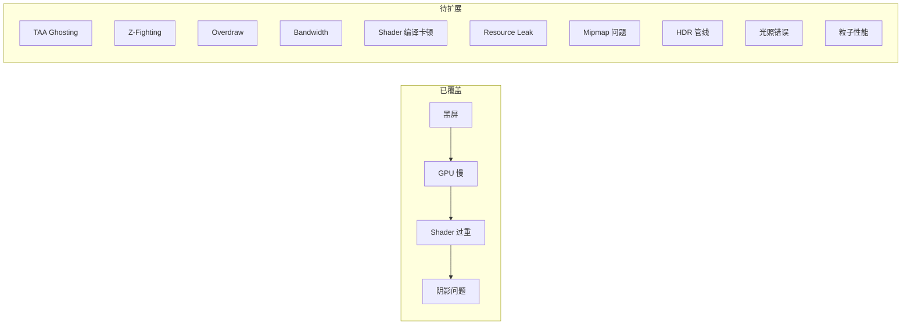

# Graphics Mode 知识库丰富计划

**创建日期**: 2026-07-07  
**目标**: 通过丰富知识库让 Graphics Mode 更加好用  
**参考文档**: [vertex-renderdoc-graphics-agent-implementation-plan.md](vertex-renderdoc-graphics-agent-implementation-plan.md)

---

## 1. 当前知识基础现状

### 1.1 已有知识分布

| 层面 | 位置 | 内容 | 状态 |
|------|------|------|------|
| System Prompt | [`graphics-agent.ts`](../src/core/prompts/sections/graphics-agent.ts) | PBR 公式、后处理算法、Compute Shader 模式、API 速查表、Bug 诊断 Checklist、性能反模式 | ✅ 已实现 |
| Mode 定义 | [`GraphicsModeDefinition.ts`](../src/services/graphics-agent/GraphicsModeDefinition.ts) | Role Definition + 9 条 Custom Instructions | ✅ 已实现 |
| Playbook | [`playbooks/`](../src/services/graphics-agent/playbooks/) | 黑屏、GPU 慢、Shader 过重、阴影问题（共 4 个） | ✅ 已实现 |
| Skills | prompt 中引用了 `write-shader`、`rendering-pipeline`、`graphics-debug`、`graphics-optimization` | ❌ 未实现，仅 prompt 中提及 |
| 外部知识文件 | 无 | ❌ 不存在 |

### 1.2 关键发现

1. **Skills 缺失**: prompt 中引用了 4 个 skill（`write-shader`、`rendering-pipeline`、`graphics-debug`、`graphics-optimization`），但这些 skill 文件并不存在。[`SkillsManager.ts`](../src/services/skills/SkillsManager.ts) 从 `.roo/skills/` 和 `.roo/skills-{mode}/` 目录发现 skill，当前没有 graphics 相关的 skill 文件。
2. **Playbook 有限**: 只有 4 个 playbook，[`GraphicsPlaybookId`](../packages/types/src/graphics.ts:265) 类型硬编码为 `"black_screen" | "gpu_slow" | "heavy_shader" | "shadow_issue"`。
3. **Prompt 知识已较丰富**: 包含 PBR/Cook-Torrance BRDF 公式、后处理算法参考（Bloom/SSAO/SSR/TAA/Tone Mapping）、API 差异表（D3D12/Vulkan/OpenGL）、Bug 诊断 Checklist（黑屏/闪烁/阴影/光照）、性能反模式（Overdraw/Bandwidth/Register Pressure/State Changes/Sync Points）等。
4. **无外部知识文件**: 所有知识都内嵌在 prompt 中（约 265 行），没有独立维护的知识文档。

### 1.3 现有 Playbook 实现分析

通过分析现有 4 个 playbook 的代码，总结出以下实现模式：

| Playbook | 文件 | 行数 | 使用的 Provider API | 检查项数量 |
|----------|------|------|---------------------|-----------|
| 黑屏排查 | [`blackScreen.ts`](../src/services/graphics-agent/playbooks/blackScreen.ts) | 187 | `getFrameSummary` → `getEventDetails` → `getPipelineState` → `getShaderInfo` | ~10 |
| GPU 慢排查 | [`gpuSlow.ts`](../src/services/graphics-agent/playbooks/gpuSlow.ts) | 242 | `getFrameSummary` → `getEventDetails` → `getShaderInfo` → Pass 分析 | ~12 |
| Shader 过重 | [`heavyShader.ts`](../src/services/graphics-agent/playbooks/heavyShader.ts) | 240 | `getFrameSummary` → `getShaderInfo` → `getPipelineState` | ~10 |
| 阴影问题 | [`shadowIssue.ts`](../src/services/graphics-agent/playbooks/shadowIssue.ts) | 218 | `getFrameSummary` → `getEventDetails` → `getPipelineState` → `getShaderInfo` | ~10 |

**共同模式**:
- 所有 playbook 都从 `getFrameSummary()` 开始
- 使用 `evidence[]` 收集证据、`suspectedIssues[]` 记录问题、`suggestions[]` 给出建议
- 置信度分三级：`high` / `medium` / `low`
- 问题分类四种：`performance` / `correctness` / `resource` / `configuration`
- 每个 playbook 约 200 行，结构清晰

---

## 2. 丰富方向与优先级

### 2.1 总体策略



### 2.2 优先级排序

| 优先级 | 方向 | ROI | 理由 |
|--------|------|-----|------|
| P0 | 补全 Skills | 最高 | 可执行的知识，prompt 已引用但未实现，属于"欠债" |
| P1 | 扩展 Playbook | 高 | 结构化排查流程，AI 按步骤执行，效果最可控 |
| P2 | 外部知识文件 | 中 | 灵活可维护，按需加载，不膨胀 system prompt |
| P3 | Prompt 内嵌补充 | 低 | 只补充最核心的，专项知识走外部文件 |

---

## 3. P0: 补全 Graphics Skills

### 3.1 背景

[`GraphicsModeDefinition.ts`](../src/services/graphics-agent/GraphicsModeDefinition.ts:69) 第 9 条 Custom Instruction 明确引用了 4 个 skill：

> "Use available skills: Leverage the write-shader, rendering-pipeline, graphics-debug, and graphics-optimization skills for structured workflows when the user's request matches their descriptions."

但这些 skill 文件不存在，导致 AI 在尝试使用这些 skill 时会失败。

### 3.2 Skill 文件规范

根据 [`SkillsManager.ts`](../src/services/skills/SkillsManager.ts) 的实现，skill 文件需要：
- 放在 `.roo/skills-graphics/{skill-name}/SKILL.md` 目录
- 使用 YAML front matter 定义元数据
- 支持 mode-specific 目录（`skills-graphics/` 只对 graphics mode 生效）

### 3.3 `write-shader` Skill

**目标**: 帮助用户编写高质量 shader 代码

**SKILL.md 结构规划**:

```yaml
---
name: write-shader
description: 编写和优化 shader 代码（HLSL/GLSL/WGSL/MSL）
modes: [graphics]
---
```

**应包含的知识模块**:

#### A. Shader 语言速查

| 特性 | HLSL (D3D12) | GLSL (Vulkan/OpenGL) | WGSL (WebGPU) | MSL (Metal) |
|------|-------------|---------------------|---------------|-------------|
| 入口函数 | `VSMain`/`PSMain` | `void main()` | `@vertex`/`@fragment` | `vertex`/`fragment` |
| 语义 | `SV_Position` | `gl_Position` | `@builtin(position)` | `[[position]]` |
| 纹理采样 | `tex.Sample(sampler, uv)` | `texture(tex, uv)` | `textureSample(tex, samp, uv)` | `tex.sample(samp, uv)` |
| 常量缓冲 | `cbuffer` | `layout(std140) uniform` | `@group(0) @binding(0) uniform` | `constant T&` |
| 计算着色器 | `[numthreads(x,y,z)]` | `layout(local_size_x) in` | `@compute @workgroup_size(x,y,z)` | `[[threads(x,y,z)]]` |

#### B. 常用数学函数与近似

```
// 快速近似
pow(x, 0.5) → sqrt(x)                    // 避免 pow 的 0.5 次方
pow(x, 2.0) → x * x                       // 避免 pow 的整数次方
1.0 / sqrt(x) → rsqrt(x)                  // HLSL 内置
exp2(x) 比 exp(x) 更快                     // 2^x vs e^x
log2(x) 比 log(x) 更快                     // log2 vs ln

// 常用近似
fast_atan(y, x) ≈ 近似 atan2              // 移动端可用
smoothstep 替代 if 分支                     // 避免 divergent branch
```

#### C. 精度选择指南

| 用途 | 推荐精度 | 理由 |
|------|----------|------|
| 位置/深度 | `highp` / `float` | 精度敏感 |
| 颜色计算 | `mediump` / `half` | 人眼不敏感 |
| LDR 颜色输出 | `lowp` 可接受 | 移动端节省带宽 |
| 法线 | `mediump` | 归一化后精度足够 |
| UV 坐标 | `highp` | 大纹理需要精度 |

#### D. Shader 模板库

- PBR Lit（Cook-Torrance + IBL）
- Unlit（纯色/纹理）
- Toon / Cel Shading
- Outline（法线外扩 / 后处理）
- Skybox（Cubemap / Procedural）
- Particle（Billboard / Mesh）
- Post-Process（Bloom / DOF / Motion Blur）
- Compute（Culling / Sort / Prefix Sum）

**落点**: `.roo/skills-graphics/write-shader/SKILL.md`

### 3.4 `rendering-pipeline` Skill

**目标**: 帮助用户设计和修改渲染管线

**应包含的知识模块**:

#### A. 渲染架构对比

| 架构 | 优点 | 缺点 | 适用场景 |
|------|------|------|----------|
| Forward | 简单、MSAA 友好 | Overdraw 严重 | 移动端、简单场景 |
| Deferred | 光照数量无关 | 带宽高、无 MSAA | PC/主机、大量光源 |
| Forward+ | 兼顾两者 | 实现复杂 | 现代 PC/主机 |
| Clustered | 3D 空间划分 | 内存开销 | 大量光源 + 大场景 |

#### B. 典型 Pass 结构

```
Frame
├── Shadow Pass (Depth-only, 多 cascade)
├── GBuffer Pass (Albedo/Normal/Roughness/Metallic/AO)
├── Lighting Pass (Deferred Lighting)
├── Transparent Pass (Forward, back-to-front)
├── Post-Process
│   ├── Bloom (Downsample → Blur → Composite)
│   ├── SSAO / GTAO
│   ├── SSR
│   ├── TAA
│   ├── Tone Mapping
│   └── FXAA / SMAA
└── UI Pass
```

#### C. GPU-Driven Rendering

- Indirect Draw 参数打包
- Compute Culling（Frustum + Occlusion）
- Mesh Shader 管线
- Work Graph（D3D12）

#### D. 帧同步策略

| 策略 | 延迟 | 吞吐量 | 适用 |
|------|------|--------|------|
| 单缓冲 | 最低 | 最低 | 调试 |
| 双缓冲 | 中 | 中 | 默认 |
| 三缓冲 | 最高 | 最高 | 高帧率 |
| Mailbox | 低 | 高 | Vulkan |

**落点**: `.roo/skills-graphics/rendering-pipeline/SKILL.md`

### 3.5 `graphics-debug` Skill

**目标**: 系统化排查渲染 Bug

**应包含的知识模块**:

#### A. 通用调试方法论

1. **二分法**: 逐步禁用 Pass/Draw 定位问题源
2. **隔离法**: 将问题 Draw 单独渲染，排除干扰
3. **对照法**: 与已知正确的帧对比差异
4. **替换法**: 用简单 Shader 替换复杂 Shader

#### B. 按症状分类的排查流程

| 症状 | 可能原因 | 排查路径 |
|------|----------|----------|
| 全黑 | 无 Draw/RT 未绑定/Shader 无输出 | → 黑屏 Playbook |
| 花屏 | 格式不匹配/未初始化/Barrier 缺失 | → 检查 RT 格式 + Barrier |
| 闪烁 | Z-Fighting/Barrier/Race Condition | → Z-Fighting Playbook |
| 颜色偏差 | Gamma/Linear/sRGB 混淆 | → 检查色彩空间链路 |
| 残影 | Motion Vector/TAA History | → TAA Ghosting Playbook |
| 阴影异常 | Bias/Cascade/Resolution | → 阴影 Playbook |
| 性能骤降 | Shader 编译/Resource Leak | → 对应 Playbook |

#### C. RenderDoc 调试技巧

- 如何快速定位问题 Draw
- 如何对比两个 Draw 的 Pipeline State
- 如何查看 Texture 内容
- 如何使用 Pixel History
- 如何使用 Mesh Viewer

**落点**: `.roo/skills-graphics/graphics-debug/SKILL.md`

### 3.6 `graphics-optimization` Skill

**目标**: GPU 性能优化指导

**应包含的知识模块**:

#### A. 性能分析方法论

```
Top-Down 分析:
  帧耗时 → Pass 耗时 → Draw 耗时 → Shader 耗时 → 指令级分析

Bottom-Up 分析:
  GPU Counter → 瓶颈分类 → 针对性优化
```

#### B. 瓶颈分类与对策

| 瓶颈类型 | 识别方法 | 优化方向 |
|----------|----------|----------|
| ALU Bound | Shader 指令数高、GPU 计算单元满载 | 简化算法、查表、降精度 |
| Bandwidth Bound | 内存读写量大、Cache Miss 高 | 压缩格式、减少 RT、Tile 优化 |
| Overdraw Bound | PS Invocations >> 屏幕像素数 | 排序、Early-Z、LOD |
| Driver Bound | CPU 提交耗时、GPU 空闲 | 批处理、Indirect、多线程 |
| Latency Bound | GPU/CPU 同步等待 | 三缓冲、异步、Fence 管理 |

#### C. 平台特定优化

**移动端（Tile-based GPU）**:
- 利用 Tile Memory 减少 Bandwidth
- 避免 `discard` 和 `alpha test`（破坏 Early-Z）
- 使用 `mediump` 降低 ALU 压力
- 控制 Render Target 数量和格式

**PC/主机（Immediate-mode GPU）**:
- 最大化 Wave/Warp 利用率
- 控制 Register Pressure 保证 Occupancy
- 使用 Async Compute 填充空闲单元
- 利用 Bindless 减少 State Change

**落点**: `.roo/skills-graphics/graphics-optimization/SKILL.md`

---

## 4. P1: 扩展 Playbook

### 4.1 现有 Playbook 覆盖范围



### 4.2 新增 Playbook 详细规格

#### 4.2.1 TAA Ghosting 排查

**ID**: `taa_ghosting`  
**所需能力**: `frameSummary`, `eventDetails`, `pipelineState`, `shaderInfo`

**排查步骤**:
1. 在帧中找到 TAA Pass（名称匹配 `taa`/`temporal`/`resolve`/`history`）
2. 检查 TAA Pass 的输入资源：
   - Current Frame（当前帧颜色）
   - History Buffer（历史帧）
   - Motion Vector（运动向量）
   - Depth Buffer
3. 检查 Motion Vector 格式和精度（RG16F/RG32F）
4. 检查 History Reprojection 的采样方式（Bilinear vs Catmull-Rom）
5. 检查 Neighborhood Clamping 范围（3x3 vs 4-tap vs Variance Clip）
6. 检查是否有 Disocclusion 检测（深度/法线/亮度阈值）
7. 检查 Unjitter 是否正确（Jitter Offset 是否被正确移除）

**常见原因与对策**:

| 原因 | 对策 |
|------|------|
| Motion Vector 精度不足 | 使用 RG16F 或 RG32F |
| History 采样使用 Bilinear | 改用 Catmull-Rom |
| Clamping 范围过大 | 使用 Variance Clip 替代硬 Clamp |
| 无 Disocclusion 检测 | 添加深度/法线不连续性检测 |
| Jitter 未正确移除 | 检查 Unjitter 偏移计算 |

#### 4.2.2 Z-Fighting 排查

**ID**: `z_fighting`  
**所需能力**: `frameSummary`, `eventDetails`, `pipelineState`

**排查步骤**:
1. 检查 Near/Far 平面设置（Near 是否过小，如 0.01）
2. 检查深度缓冲格式（D16/D24/D32F/D24S8）
3. 检查是否使用 Reversed-Z（深度范围 1→0 vs 0→1）
4. 检查共面几何体的 Depth Bias / Polygon Offset
5. 检查 Shadow Map 的 Bias 设置（Constant Bias + Slope-Scaled Bias）
6. 检查是否有两个 Draw 写入相同深度区域

**深度精度参考**:

| 配置 | 精度表现 | 推荐场景 |
|------|----------|----------|
| D16 + 0→1 | 最差 | 不推荐 |
| D24 + 0→1 | 中等 | 简单场景 |
| D32F + 0→1 | 较好 | 通用 |
| D32F + 1→0 (Reversed-Z) | 最佳 | 推荐 |

#### 4.2.3 Overdraw 分析

**ID**: `overdraw`  
**所需能力**: `frameSummary`, `eventDetails`, `pipelineState`

**排查步骤**:
1. 统计总 Pixel Shader Invocations
2. 计算 Overdraw Ratio = PS Invocations / 屏幕像素数
3. 按 Pass 分解 Overdraw 贡献
4. 识别高 Overdraw 的 Draw Call
5. 检查透明物体排序（是否 back-to-front）
6. 检查 Early-Z / Pre-Z Pass 是否启用
7. 检查粒子/体积效果的 Overdraw 贡献
8. 检查是否有不必要的 Fullscreen Pass

**Overdraw Ratio 参考**:

| Ratio | 评级 | 建议 |
|-------|------|------|
| < 2x | 优秀 | 无需优化 |
| 2x-4x | 可接受 | 关注透明物体 |
| 4x-8x | 需关注 | 优化排序和 Early-Z |
| > 8x | 严重 | 需要架构级优化 |

#### 4.2.4 Bandwidth 瓶颈分析

**ID**: `bandwidth_bottleneck`  
**所需能力**: `frameSummary`, `eventDetails`, `pipelineState`

**排查步骤**:
1. 统计所有 Render Target 的格式和尺寸
2. 计算每帧总读写量 = Σ(RT 格式字节 × 像素数 × 读写次数)
3. 检查 RT 格式是否过大（R32G32B32A32F vs R11G11B10F）
4. 检查是否有不必要的 Load/Store（如只写入的 RT 不需要 Load）
5. 检查 MSAA Resolve 时机（是否过早/过晚）
6. 检查 Depth Buffer 的 Load/Store 设置
7. 对比 GPU 带宽预算（如移动端 ~20 GB/s，桌面端 ~500 GB/s）

**RT 格式选择参考**:

| 用途 | 推荐格式 | 字节/像素 |
|------|----------|-----------|
| LDR 颜色 | R8G8B8A8_UNORM | 4 |
| HDR 颜色 | R11G11B10F | 4 |
| HDR 高质量 | R16G16B16A16F | 8 |
| 法线 | R8G8_SNORM 或 R16G16F | 2-4 |
| 深度 | D32F | 4 |
| 粗糙度/金属度 | R8_UNORM (打包) | 1 |

#### 4.2.5 Shader 编译卡顿

**ID**: `shader_compile_stall`  
**所需能力**: `frameSummary`, `eventDetails`

**排查步骤**:
1. 检查帧中是否有 PSO/Pipeline State 创建事件
2. 检查是否有 Shader 编译相关的 API 调用
3. 统计 Shader Variant 数量（同一 Shader 的不同排列组合）
4. 检查是否有 PSO 缓存机制（Pipeline Library / Shader Cache）
5. 检查异步编译是否启用
6. 检查首次运行 vs 后续运行的帧时间差异

**常见原因与对策**:

| 原因 | 对策 |
|------|------|
| 运行时编译 PSO | 预编译 + Pipeline Library |
| Shader Variant 爆炸 | 减少 Permutation、使用 Uber Shader |
| 无缓存机制 | 实现 PSO Cache 持久化 |
| 同步编译阻塞 | 异步编译 + Fallback Shader |

#### 4.2.6 Resource Leak 排查

**ID**: `resource_leak`  
**所需能力**: `frameSummary`, `eventDetails`

**排查步骤**:
1. 统计帧中资源创建/销毁事件
2. 检查 Descriptor Heap/Pool 使用量是否持续增长
3. 检查 Command Allocator 是否正确回收
4. 检查 Fence 等待是否完整（是否有未等待的 Fence）
5. 检查 Swap Chain 资源是否正确释放
6. 对比连续多帧的资源数量

#### 4.2.7 Mipmap 问题排查

**ID**: `mipmap_issue`  
**所需能力**: `frameSummary`, `eventDetails`, `pipelineState`

**排查步骤**:
1. 检查关键纹理是否有完整 Mip Chain
2. 检查 Mip 生成算法（Hardware Generate vs Custom）
3. 检查 Sampler 的 MinFilter（是否使用 Mipmap 过滤）
4. 检查 Mip Bias / LOD Clamp 设置
5. 检查各向异性过滤级别（推荐 8x-16x）
6. 检查是否有纹理缺少 Mip 导致 Cache Miss 增加

#### 4.2.8 HDR 管线验证

**ID**: `hdr_pipeline`  
**所需能力**: `frameSummary`, `eventDetails`, `pipelineState`, `shaderInfo`

**排查步骤**:
1. 检查 Lighting RT 格式是否支持 HDR（FP16/R11G11B10F）
2. 检查光照计算是否在 Linear Space（非 sRGB）
3. 检查 Tone Mapping 算法选择（ACES/AgX/Hable/Reinhard）
4. 检查 Gamma/sRGB 转换是否正确（Linear → sRGB 在最后一步）
5. 检查 Bloom 阈值和 Knee 设置
6. 检查是否有 NaN/Inf 值（光照强度过大导致溢出）
7. 检查 UI 是否在 Tone Mapping 之后渲染

#### 4.2.9 光照错误排查

**ID**: `lighting_error`  
**所需能力**: `frameSummary`, `eventDetails`, `pipelineState`, `shaderInfo`

**排查步骤**:
1. 检查法线空间一致性（World/Tangent/View 空间是否统一）
2. 检查 Gamma/Linear 空间（光照是否在 Linear Space 计算）
3. 检查 HDR 溢出（光照强度是否导致 NaN/Inf）
4. 检查法线贴图格式（OpenGL vs DirectX 法线贴图 Y 轴差异）
5. 检查 TBN 矩阵计算是否正确
6. 检查光照衰减公式（是否有除零风险）

#### 4.2.10 粒子性能排查

**ID**: `particle_performance`  
**所需能力**: `frameSummary`, `eventDetails`, `pipelineState`, `shaderInfo`

**排查步骤**:
1. 找到粒子相关的 Pass/Draw Call
2. 统计粒子数量和 Overdraw
3. 检查粒子排序方式（是否 back-to-front）
4. 检查粒子 Shader 复杂度
5. 检查是否使用 GPU 模拟（Compute Shader）
6. 检查粒子纹理图集是否合理

### 4.3 Playbook 实现模板

基于现有 playbook 的代码模式，新 playbook 应遵循以下模板：

```ts
import type { GraphicsCaptureProvider } from "../../graphics-provider/GraphicsCaptureProvider"
import type {
    GraphicsWorkflowResult,
    EvidenceItem,
    SuspectedIssue,
} from "../../graphics-provider/GraphicsProviderTypes"
import type { GraphicsPlaybook } from "./playbookRunner"

export const xxxPlaybook: GraphicsPlaybook = {
    id: "xxx",
    name: "XXX 排查",
    description: "诊断 XXX 问题的常见原因",
    requiredCapabilities: ["frameSummary", "eventDetails", "pipelineState"],

    async execute(
        provider: GraphicsCaptureProvider,
        userMessage?: string,
    ): Promise<GraphicsWorkflowResult> {
        const evidence: EvidenceItem[] = []
        const suspectedIssues: SuspectedIssue[] = []
        const suggestions: string[] = []

        // Step 1: 获取帧摘要
        const frameSummary = await provider.getFrameSummary()
        if (!frameSummary.success) {
            return { success: false, summary: "无法获取帧摘要", evidence: [], suspectedIssues: [], suggestions: [], error: frameSummary.error }
        }

        // Step 2-N: 具体排查逻辑
        // ...

        return {
            success: true,
            summary: buildSummary(suspectedIssues, evidence),
            evidence,
            suspectedIssues,
            suggestions,
        }
    },
}
```

### 4.4 需要修改的公共文件

| 文件 | 变更内容 |
|------|----------|
| [`packages/types/src/graphics.ts`](../packages/types/src/graphics.ts:265) | 扩展 `GraphicsPlaybookId` 联合类型，新增 10 个 ID |
| [`playbookRunner.ts`](../src/services/graphics-agent/playbooks/playbookRunner.ts:52) | 在 `playbookRegistry` 中注册新 playbook |

---

## 5. P2: 外部知识文件

### 5.1 设计理念

当前所有知识都内嵌在 [`graphics-agent.ts`](../src/core/prompts/sections/graphics-agent.ts) 的 `GRAPHICS_MODE_PROMPT` 常量中（约 265 行）。这有几个问题：

1. **不可独立维护**: 修改知识需要改 TypeScript 代码
2. **无法按需加载**: 每次进入 Graphics Mode 都加载全部知识
3. **无法复用**: 其他 Mode 或 Skill 无法引用这些知识

外部知识文件可以解决这些问题。

### 5.2 知识文件目录结构

```
src/core/prompts/sections/graphics-knowledge/
  pbr-reference.md          # PBR 光照模型完整参考
  gpu-architecture.md       # GPU 架构知识
  mobile-optimization.md    # 移动端 GPU 优化专题
  advanced-techniques.md    # 高级渲染技术
  engine-patterns.md        # 常见引擎渲染架构
  api-deep-dive.md          # D3D12/Vulkan 深度对比
  math-reference.md         # 图形学数学参考
  color-science.md          # 色彩科学
```

### 5.3 知识文件内容详细规划

#### `pbr-reference.md` (~2000 tokens)

```markdown
# PBR 光照模型参考

## Cook-Torrance BRDF
- NDF (Normal Distribution Function)
  - GGX/Trowbridge-Reitz: D = α² / (π * ((N·H)² * (α² - 1) + 1)²)
  - Beckmann: 更物理正确但计算更贵
- Geometry Function
  - Smith's method with Schlick-GGX
  - Direct lighting: k = (α+1)²/8
  - IBL: k = α²/2
- Fresnel
  - Schlick: F = F0 + (1 - F0) * (1 - V·H)^5
  - F0 参考值表（金属/非金属）

## IBL (Image-Based Lighting)
- Diffuse IBL: Irradiance Map 预计算
- Specular IBL: Pre-filtered Environment Map + BRDF LUT
- 多散射能量补偿 (Kulla-Conty)

## Energy Conservation
- kd = (1 - F) * (1 - metallic)
- 金属无漫反射
- 能量守恒验证方法

## 常见变体
- Disney BRDF
- Unreal Engine 模型
- Frostbite 模型
```

#### `gpu-architecture.md` (~1500 tokens)

```markdown
# GPU 架构知识

## Immediate-Mode GPU (IMR)
- 代表: NVIDIA, AMD
- 特点: 逐三角形处理，大 Cache
- 优化方向: 减少 State Change，最大化 Wave 利用率

## Tile-Based GPU (TBR/TBDR)
- 代表: Apple, ARM Mali, Qualcomm Adreno, Imagination PowerVR
- 特点: 分块渲染，Tile Memory 极快
- 优化方向: 减少 Bandwidth，利用 Tile Memory

## Wave/Warp 执行模型
- NVIDIA: Warp (32 threads)
- AMD: Wave64 (64 threads) / Wave32
- Apple: SIMD Group (32 threads)
- 关键: 避免 Divergent Branch

## 内存层次
- Registers → Shared Memory → L1 Cache → L2 Cache → VRAM
- 各级延迟和带宽对比
- Occupancy 与 Register Pressure 的关系
```

#### `mobile-optimization.md` (~1500 tokens)

```markdown
# 移动端 GPU 优化

## Bandwidth 预算
- 典型移动端 GPU: 15-30 GB/s
- 桌面端 GPU: 300-900 GB/s
- 移动端必须最小化 RT 读写

## Precision 选择
- mediump (FP16): 颜色计算、法线
- highp (FP32): 位置、深度、UV
- lowp: LDR 颜色（可接受）

## Thermal Throttling
- 持续高负载会导致降频
- 建议: 动态分辨率、自适应质量

## Tile Memory 优化
- Load Op: DONT_CARE 优于 LOAD
- Store Op: DONT_CARE 优于 STORE
- 利用 Subpass 合并减少 Bandwidth
```

#### `advanced-techniques.md` (~2000 tokens)

```markdown
# 高级渲染技术

## Ray Tracing 管线
- DXR / VK_KHR_ray_tracing
- Acceleration Structure (BLAS/TLAS)
- Ray Generation / Closest Hit / Miss / Any Hit Shaders
- 降噪算法 (SVGF / ReSTIR)

## Mesh Shaders
- Task Shader + Mesh Shader 替代 VS/GS
- GPU-Driven Culling
- 动态 LOD

## Variable Rate Shading (VRS)
- Per-Draw / Per-Primitive / Screen-Space
- 适用场景: UI 区域、运动模糊区域

## Work Graphs (D3D12)
- GPU 自主调度工作
- 替代 Compute + Indirect Draw

## Sampler Feedback
- 纹理空间着色
- 按需加载 Mip
```

#### `engine-patterns.md` (~1500 tokens)

```markdown
# 常见引擎渲染架构

## Unreal Engine
- Deferred + Forward 混合
- Base Pass → Lighting → Translucency → Post Process
- Virtual Shadow Maps
- Nanite (Mesh Shader / Compute Culling)
- Lumen (Software RT + Hardware RT)

## Unity SRP
- URP: Forward / Forward+
- HDRP: Deferred + Clustered
- Render Graph 系统

## 自研引擎典型架构
- Render Graph / Frame Graph
- Resource Aliasing
- Async Compute
- GPU-Driven Pipeline
```

#### `api-deep-dive.md` (~2000 tokens)

```markdown
# D3D12 / Vulkan 深度对比

## 资源管理
- D3D12: Committed / Placed / Reserved Resources
- Vulkan: VkImage / VkBuffer + VkDeviceMemory
- 内存分配策略 (VMA / D3D12MA)

## 同步模型
- D3D12: Resource Barrier (Transition / UAV / Aliasing)
- Vulkan: Pipeline Barrier + Semaphore + Fence
- 常见同步错误和调试方法

## 多线程渲染
- D3D12: Command List + Command Queue
- Vulkan: Command Buffer + Queue
- 线程模型: 主线程提交 vs 多线程录制

## Descriptor 管理
- D3D12: Descriptor Heap (CBV/SRV/UAV / Sampler / RTV / DSV)
- Vulkan: Descriptor Set + Descriptor Pool
- Bindless 实现方案
```

#### `math-reference.md` (~1500 tokens)

```markdown
# 图形学数学参考

## 变换矩阵
- Model → World → View → Projection → Clip → NDC → Screen
- 左手 vs 右手坐标系
- 列主序 vs 行主序

## 四元数
- 旋转表示和插值 (SLERP / NLERP)
- 万向锁问题和四元数优势

## 球谐函数 (Spherical Harmonics)
- L0/L1/L2 阶数
- 用于 IBL Diffuse 和 Light Probe

## 常用 Noise 函数
- Perlin / Simplex / Worley
- 用于程序化纹理和效果

## 曲线和曲面
- Bezier / B-Spline / Catmull-Rom
- 用于动画和路径
```

#### `color-science.md` (~1500 tokens)

```markdown
# 色彩科学

## 色域
- sRGB: 标准显示器
- DCI-P3: 数字影院
- Rec.2020: HDR 显示器
- 色域转换矩阵

## Tone Mapping
- Reinhard: 简单但颜色偏移
- ACES (Filmic): 电影级，行业标准
- AgX: 更好的颜色保持
- Hable (Uncharted 2): 游戏常用

## HDR 标准
- HDR10: PQ (ST.2084) + 10bit
- Dolby Vision: PQ + 12bit + 动态元数据
- HLG: 广播兼容

## Gamma / sRGB 转换
- Linear → sRGB: x <= 0.0031308 ? 12.92x : 1.055 * x^(1/2.4) - 0.055
- sRGB → Linear: x <= 0.04045 ? x/12.92 : ((x+0.055)/1.055)^2.4
```

### 5.4 按需加载机制

在 [`graphics-agent.ts`](../src/core/prompts/sections/graphics-agent.ts) 中实现按需加载：

```ts
import * as fs from "fs"
import * as path from "path"

const KNOWLEDGE_DIR = path.join(__dirname, "graphics-knowledge")

function loadKnowledge(filename: string): string {
    const filePath = path.join(KNOWLEDGE_DIR, filename)
    try {
        return fs.readFileSync(filePath, "utf-8")
    } catch {
        return ""
    }
}

// 根据用户意图加载相关知识
function loadRelevantKnowledge(intent: string, userMessage: string): string {
    const knowledge: string[] = []

    // 始终加载核心知识
    knowledge.push(loadKnowledge("pbr-reference.md"))

    // 根据意图加载专项知识
    if (intent.includes("performance") || intent.includes("frame")) {
        knowledge.push(loadKnowledge("gpu-architecture.md"))
    }
    if (userMessage.includes("mobile") || userMessage.includes("移动")) {
        knowledge.push(loadKnowledge("mobile-optimization.md"))
    }
    if (intent.includes("shader") || userMessage.includes("shader")) {
        knowledge.push(loadKnowledge("math-reference.md"))
    }

    return knowledge.filter(Boolean).join("\n\n---\n\n")
}
```

**加载策略**:

| 意图/关键词 | 加载的知识文件 |
|-------------|---------------|
| 所有 Graphics Mode | `pbr-reference.md` |
| 帧分析/性能 | + `gpu-architecture.md` |
| 移动端相关 | + `mobile-optimization.md` |
| Shader 相关 | + `math-reference.md` |
| 高级技术 | + `advanced-techniques.md` |
| 引擎架构 | + `engine-patterns.md` |
| API 差异 | + `api-deep-dive.md` |
| 颜色/HDR | + `color-science.md` |

---

## 6. P3: 扩展 Prompt 内嵌知识

### 6.1 原则

只补充"每次都需要"的核心知识，专项知识走外部文件或 Skills。

### 6.2 建议补充到 `graphics-agent.ts` 的内容

#### A. GPU 架构简述（~200 tokens）

```
## GPU Architecture Quick Reference

### Immediate-Mode GPU (IMR)
- NVIDIA, AMD desktop GPUs
- Process triangles sequentially, large caches
- Optimize: reduce state changes, maximize wave utilization

### Tile-Based GPU (TBR/TBDR)
- Apple, ARM Mali, Qualcomm Adreno, PowerVR
- Render in tiles, fast on-chip tile memory
- Optimize: minimize bandwidth, use load/store ops wisely
```

#### B. 移动端 vs 桌面端差异（~150 tokens）

```
## Mobile vs Desktop GPU Differences

| Aspect | Mobile | Desktop |
|--------|--------|---------|
| Architecture | Tile-based | Immediate-mode |
| Bandwidth | 15-30 GB/s | 300-900 GB/s |
| Precision | mediump preferred | highp default |
| Thermal | Throttles quickly | Active cooling |
| RT Count | 4-8 max | 8+ supported |
```

#### C. Reversed-Z 说明（~100 tokens）

```
## Reversed-Z (Recommended Depth Setup)

- Store depth as 1.0 (near) → 0.0 (far) instead of 0.0 → 1.0
- Use float32 depth buffer (D32F)
- Near plane can be very close (0.01 or less) without precision loss
- Far plane can be very far (10000+) with good precision
- Always prefer Reversed-Z for new projects
```

### 6.3 注意事项

- Prompt 越长，token 消耗越大
- 过多知识可能稀释核心指令权重
- 建议只补充"每次都需要"的知识，专项知识走外部文件或 Skills
- 当前 prompt 约 265 行，建议控制在 350 行以内

---

## 7. 实施路线图

```mermaid
graph LR
    subgraph Phase A - 补全 Skills
        A1[write-shader] --> A2[rendering-pipeline]
        A2 --> A3[graphics-debug]
        A3 --> A4[graphics-optimization]
    end
    
    subgraph Phase B - 扩展 Playbook
        B1[TAA Ghosting] --> B2[Z-Fighting]
        B2 --> B3[Overdraw]
        B3 --> B4[Bandwidth]
        B4 --> B5[Shader Compile]
        B5 --> B6[Resource Leak]
        B6 --> B7[Mipmap]
        B7 --> B8[HDR Pipeline]
        B8 --> B9[Lighting Error]
        B9 --> B10[Particle Perf]
    end
    
    subgraph Phase C - 外部知识文件
        C1[创建目录结构] --> C2[编写 8 个知识文件]
        C2 --> C3[实现按需加载]
    end
    
    subgraph Phase D - Prompt 补充
        D1[GPU 架构简述] --> D2[移动端差异]
        D2 --> D3[Reversed-Z]
    end
    
    A4 --> B1
    B10 --> C1
    C3 --> D1
```



---

## 8. 涉及的文件变更清单

### 8.1 新增文件

| 文件 | 类型 | 说明 |
|------|------|------|
| `.roo/skills-graphics/write-shader/SKILL.md` | Skill | Shader 编写指导 |
| `.roo/skills-graphics/rendering-pipeline/SKILL.md` | Skill | 渲染管线设计 |
| `.roo/skills-graphics/graphics-debug/SKILL.md` | Skill | 图形调试方法论 |
| `.roo/skills-graphics/graphics-optimization/SKILL.md` | Skill | GPU 性能优化 |
| `src/services/graphics-agent/playbooks/taaGhosting.ts` | Playbook | TAA Ghosting 排查 |
| `src/services/graphics-agent/playbooks/zFighting.ts` | Playbook | Z-Fighting 排查 |
| `src/services/graphics-agent/playbooks/overdraw.ts` | Playbook | Overdraw 分析 |
| `src/services/graphics-agent/playbooks/bandwidthBottleneck.ts` | Playbook | Bandwidth 瓶颈 |
| `src/services/graphics-agent/playbooks/shaderCompileStall.ts` | Playbook | Shader 编译卡顿 |
| `src/services/graphics-agent/playbooks/resourceLeak.ts` | Playbook | Resource Leak 排查 |
| `src/services/graphics-agent/playbooks/mipmapIssue.ts` | Playbook | Mipmap 问题 |
| `src/services/graphics-agent/playbooks/hdrPipeline.ts` | Playbook | HDR 管线验证 |
| `src/services/graphics-agent/playbooks/lightingError.ts` | Playbook | 光照错误排查 |
| `src/services/graphics-agent/playbooks/particlePerformance.ts` | Playbook | 粒子性能排查 |
| `src/core/prompts/sections/graphics-knowledge/pbr-reference.md` | 知识文件 | PBR 光照模型参考 |
| `src/core/prompts/sections/graphics-knowledge/gpu-architecture.md` | 知识文件 | GPU 架构知识 |
| `src/core/prompts/sections/graphics-knowledge/mobile-optimization.md` | 知识文件 | 移动端优化 |
| `src/core/prompts/sections/graphics-knowledge/advanced-techniques.md` | 知识文件 | 高级渲染技术 |
| `src/core/prompts/sections/graphics-knowledge/engine-patterns.md` | 知识文件 | 引擎渲染架构 |
| `src/core/prompts/sections/graphics-knowledge/api-deep-dive.md` | 知识文件 | API 深度对比 |
| `src/core/prompts/sections/graphics-knowledge/math-reference.md` | 知识文件 | 数学参考 |
| `src/core/prompts/sections/graphics-knowledge/color-science.md` | 知识文件 | 色彩科学 |

### 8.2 修改文件

| 文件 | 变更内容 |
|------|----------|
| [`packages/types/src/graphics.ts`](../packages/types/src/graphics.ts:265) | 扩展 `GraphicsPlaybookId` 联合类型，新增 10 个 ID |
| [`playbookRunner.ts`](../src/services/graphics-agent/playbooks/playbookRunner.ts:52) | 在 `playbookRegistry` 中注册 10 个新 playbook |
| [`graphics-agent.ts`](../src/core/prompts/sections/graphics-agent.ts) | 补充核心知识 + 实现按需加载逻辑 |
| [`GraphicsModeDefinition.ts`](../src/services/graphics-agent/GraphicsModeDefinition.ts) | 更新 customInstructions 引用新 skill |

---

## 9. 成功标准

实施完成后，Graphics Mode 应该能够：

| 场景 | 当前表现 | 期望表现 |
|------|----------|----------|
| 用户问"帮我写个 PBR shader" | 基于 prompt 内嵌知识回答 | 调用 `write-shader` skill，输出完整模板 + 最佳实践 |
| 用户问"TAA 有残影怎么办" | 无专项 playbook | 执行 `taa_ghosting` playbook，系统化排查 |
| 用户问"移动端怎么优化带宽" | 基于通用知识回答 | 加载 `mobile-optimization.md`，给出精确建议 |
| 用户问"这个引擎的渲染架构是什么" | 无引擎知识 | 加载 `engine-patterns.md`，对比分析 |
| 用户问"帮我排查 Z-Fighting" | 无专项 playbook | 执行 `z_fighting` playbook，检查 Reversed-Z 等 |
