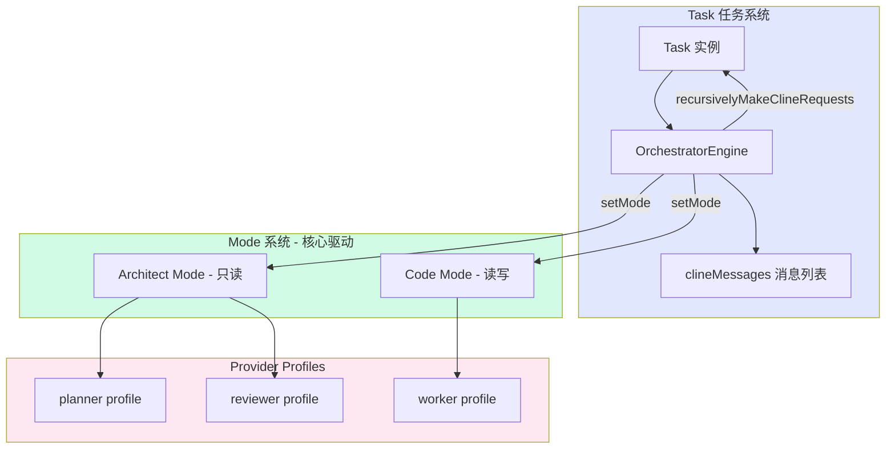
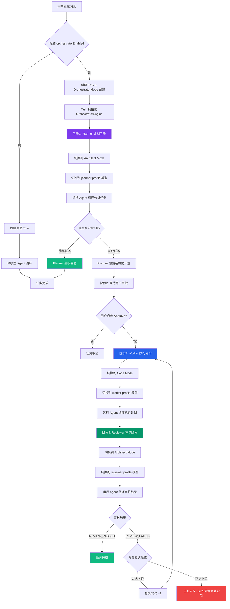
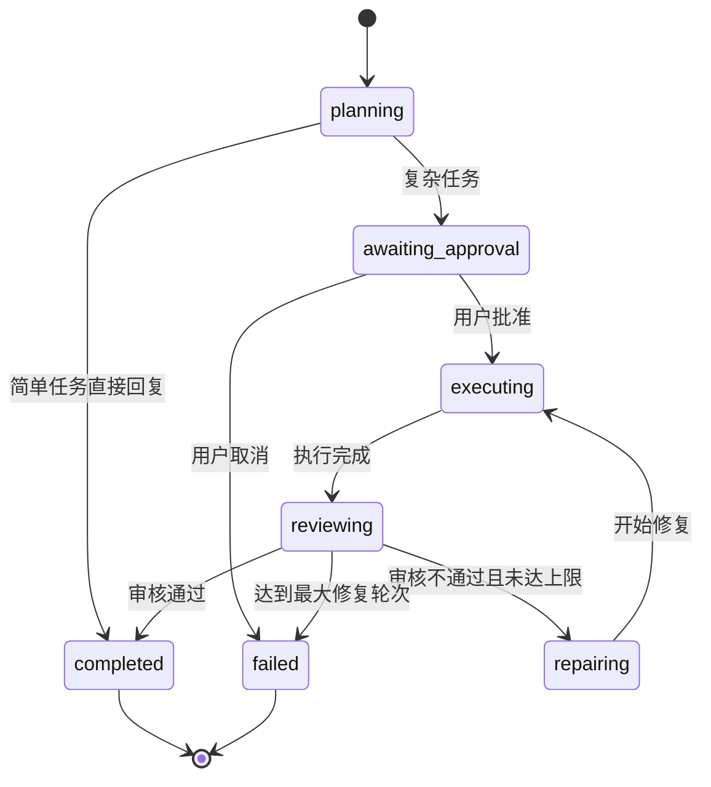
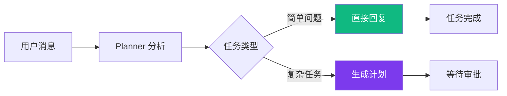
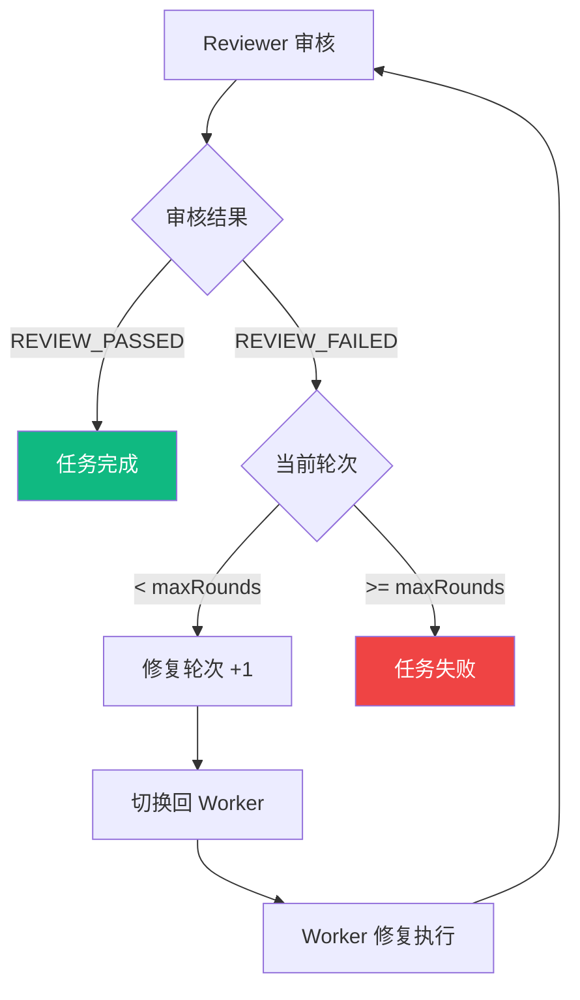

# 编排器实现与执行流程

> 本文档详细描述 VSCode 扩展项目中编排器（Orchestrator）功能的实现机制和执行流程。

**文档版本**：v2.0  
**创建日期**：2026-06-11  
**最后更新**：2026-06-11  
**状态**：已实现

---

## 1. 概述

### 1.1 什么是编排器

编排器是一个**多模型协作工作流系统**，它通过在 Planner（计划者）、Worker（执行者）、Reviewer（审核者）三个角色之间切换，实现复杂任务的自动化处理。

### 1.2 核心设计理念

编排器本质上只是 **Task 的一种工作流模式**——在对话过程中，API 调用在不同角色之间切换，但**对话本身仍然是 Task**。

```
正确认知：
Task（编排模式）= Task + 多模型角色切换流程
                ≠ 独立于 Task 之外的新系统
```

### 1.3 架构优势

| 特性 | 说明 |
|------|------|
| 统一消息系统 | 所有消息通过 Task 的 `say()` 方法写入 `clineMessages` |
| 历史持久化 | 编排对话自动享受 Task 的历史保存、恢复能力 |
| 智能分流 | 简单任务直接回复，复杂任务走完整流程 |
| 修复循环 | Reviewer 发现问题可触发 Worker 重新执行 |
| 轻量级设计 | 复用现有 Mode 系统，无需额外组件 |

---

## 2. 系统架构

### 2.1 整体架构图



### 2.2 核心组件说明

| 组件 | 文件路径 | 职责 |
|------|----------|------|
| **OrchestratorEngine** | [`src/core/task/OrchestratorEngine.ts`](../src/core/task/OrchestratorEngine.ts) | 编排引擎，驱动 Plan → Approve → Execute → Review → Repair 循环 |
| **Task** | [`src/core/task/Task.ts`](../src/core/task/Task.ts) | 任务系统，集成编排模式并提供消息写入、Agent 循环等能力 |
| **ClineProvider** | [`src/core/webview/ClineProvider.ts`](../src/core/webview/ClineProvider.ts) | Provider 层，提供 Mode 切换、Profile 切换、状态推送等能力 |

### 2.3 架构设计说明

编排器采用**轻量级 Mode 链设计**，而非组件化设计：

- **不依赖**独立的 Planner、Reviewer、Worker 组件
- **复用**现有 Mode 系统的 prompts、tools 和 agent loop 基础设施
- **通过** `provider.setMode()` 和 `provider.setProviderProfile()` 切换角色
- **通过** `task.recursivelyMakeClineRequests()` 运行 Agent 循环

这种设计的优势：
1. 代码简洁，无需维护额外的组件
2. 复用现有基础设施，减少重复代码
3. 自然享受 Task 的历史持久化、消息系统等能力

---

## 3. 执行流程

### 3.1 完整工作流程图



### 3.2 阶段详解

#### 阶段 1：Planner 计划阶段

**目标**：分析用户需求，决定是直接回复还是生成结构化计划。

**执行步骤**：

1. 切换到 **Architect Mode**（只读权限）
2. 切换到 **planner profile** 指定的模型
3. 注入编排器上下文（告知 AI 其角色）
4. 运行 Agent 循环，分析用户消息
5. 根据任务复杂度做出判断：
   - **简单任务**：直接回复，任务完成
   - **复杂任务**：输出结构化计划，进入等待审批状态

**代码位置**：[`OrchestratorEngine.run()`](../src/core/task/OrchestratorEngine.ts:85)

```typescript
async run(userMessage: string): Promise<void> {
    this.state.phase = "planning"
    
    // 切换到 Planner Mode + model
    const provider = this.task.getProvider()
    await provider.setMode(this.config.planner.mode)
    await provider.setProviderProfile(this.config.planner.profile)
    
    // 注入编排器上下文
    const orchestratorContext = this.buildOrchestratorContext("planner")
    
    // 运行 Agent 循环
    await this.task.recursivelyMakeClineRequests(
        [{ type: "text", text: `${orchestratorContext}\n\n<user_message>\n${userMessage}\n</user_message>` }],
        true,
    )
    
    // 检查是否直接回复
    const lastMessage = this.task.clineMessages[this.task.clineMessages.length - 1]
    if (lastMessage?.ask === "completion_result" || lastMessage?.say === "completion_result") {
        this.state.phase = "completed"
        return
    }
    
    // 否则等待用户审批
    this.state.phase = "awaiting_approval"
}
```

#### 阶段 2：等待用户审批

**目标**：展示计划给用户，等待确认。

**执行步骤**：

1. Planner 输出的计划显示在聊天面板
2. 用户查看计划内容
3. 用户点击 **Approve Plan** 或 **Cancel**

**代码位置**：[`Task.approveOrchestratorPlan()`](../src/core/task/Task.ts:4572)

```typescript
public async approveOrchestratorPlan(): Promise<void> {
    if (!this.orchestratorEngine) {
        throw new Error("Task is not in orchestrator mode")
    }
    await this.orchestratorEngine.approvePlan()
}
```

#### 阶段 3：Worker 执行阶段

**目标**：按照计划执行代码修改。

**执行步骤**：

1. 切换到 **Code Mode**（读写权限）
2. 切换到 **worker profile** 指定的模型
3. 注入编排器上下文（告知 AI 其角色）
4. 运行 Agent 循环，执行计划中的任务
5. 修改文件、运行命令、生成代码

**代码位置**：[`OrchestratorEngine.runWorkerStage()`](../src/core/task/OrchestratorEngine.ts:177)

```typescript
private async runWorkerStage(): Promise<void> {
    this.state.phase = "executing"
    
    const provider = this.task.getProvider()
    await provider.setMode(this.config.worker.mode)
    await provider.setProviderProfile(this.config.worker.profile)
    
    await this.task.sayWithOrchestratorMeta("text", "⚡ **执行者正在按照计划执行...**", {
        orchestratorRole: "worker",
        orchestratorModelId: this.config.worker.profile,
    })
    
    // 注入编排器上下文
    const orchestratorContext = this.buildOrchestratorContext("worker")
    
    // 运行 Agent 循环执行计划
    await this.task.recursivelyMakeClineRequests(
        [{ type: "text", text: `${orchestratorContext}\n\n请按照上方的执行计划...` }],
        false,
    )
}
```

#### 阶段 4：Reviewer 审核阶段

**目标**：审核执行结果，决定通过或需要修复。

**执行步骤**：

1. 切换到 **Architect Mode**（只读权限）
2. 切换到 **reviewer profile** 指定的模型
3. 注入编排器上下文（告知 AI 其角色）
4. 运行 Agent 循环，审核执行结果
5. 输出审核结论：
   - **REVIEW_PASSED**：审核通过，任务完成
   - **REVIEW_FAILED**：审核不通过，进入修复循环

**代码位置**：[`OrchestratorEngine.runReviewerStage()`](../src/core/task/OrchestratorEngine.ts:216)

```typescript
private async runReviewerStage(): Promise<void> {
    const maxRounds = this.config.maxRepairRounds ?? 2
    
    while (this.state.repairRound <= maxRounds) {
        this.state.phase = "reviewing"
        
        const provider = this.task.getProvider()
        await provider.setMode(this.config.reviewer.mode)
        await provider.setProviderProfile(this.config.reviewer.profile)
        
        // 注入编排器上下文
        const orchestratorContext = this.buildOrchestratorContext("reviewer")
        
        // 运行 Agent 循环审核结果
        await this.task.recursivelyMakeClineRequests(
            [{ type: "text", text: `${orchestratorContext}\n\n请审查上方的执行结果...` }],
            false,
        )
        
        const reviewResult = this.extractReviewResult()
        
        if (reviewResult === "passed") {
            this.state.phase = "completed"
            return
        }
        
        // 审核不通过，检查是否可以修复
        if (this.state.repairRound >= maxRounds) {
            this.state.phase = "failed"
            return
        }
        
        this.state.repairRound++
        await this.runWorkerStage()  // 回到 Worker 修复
    }
}
```

---

## 4. 状态管理

### 4.1 状态机定义

编排器维护一个清晰的状态机，跟踪当前执行阶段：

```typescript
type OrchestratorPhase = 
    | "planning"           // Planner 正在分析
    | "awaiting_approval"  // 等待用户审批计划
    | "executing"          // Worker 正在执行
    | "reviewing"          // Reviewer 正在审核
    | "repairing"          // 准备修复
    | "completed"          // 任务完成
    | "failed"             // 任务失败
```

### 4.2 状态转换图



### 4.3 状态获取

状态通过 [`OrchestratorEngine.getState()`](../src/core/task/OrchestratorEngine.ts:48) 方法获取：

```typescript
getState(): Readonly<OrchestratorModeState> {
    return { ...this.state }
}
```

并通过 [`ClineProvider.postStateToWebview()`](../src/core/webview/ClineProvider.ts:2332) 推送到前端：

```typescript
orchestratorSession: (() => {
    if (!(orchestratorEnabled ?? false)) return undefined
    const task = this.getCurrentTask()
    const oState = task?.orchestratorState
    const oConfig = task?.orchestratorMode
    // ... 构建状态快照
})()
```

---

## 5. 消息流转

### 5.1 消息写入机制

所有编排消息都通过 [`Task.sayWithOrchestratorMeta()`](../src/core/task/Task.ts:4592) 方法写入：

```typescript
public async sayWithOrchestratorMeta(
    type: ClineSay,
    text: string | undefined,
    orchestratorMeta: { orchestratorRole?: string; orchestratorModelId?: string },
): Promise<void> {
    await this.say(type, text, undefined, undefined, {
        orchestratorRole: orchestratorMeta.orchestratorRole as "planner" | "worker" | "reviewer",
        orchestratorModelId: orchestratorMeta.orchestratorModelId,
    })
}
```

### 5.2 消息元数据

每条编排消息携带两个关键字段：

| 字段 | 类型 | 说明 |
|------|------|------|
| `orchestratorRole` | `"planner" \| "worker" \| "reviewer"` | 产生该消息的角色 |
| `orchestratorModelId` | `string` | 使用的模型标识，如 `"qwen-max"` |

### 5.3 UI 渲染效果

消息在聊天面板中显示角色标签和模型名：

```
🧠 计划者 · qwen-max
⚡ 执行者 · deepseek-chat
🔍 审核者 · gpt-4o
```

---

## 6. 入口点

### 6.1 消息处理器入口

编排器的入口在 [`webviewMessageHandler.ts`](../src/core/webview/webviewMessageHandler.ts:622)：

```typescript
case "newTask": {
    const orchestratorEnabled = getGlobalState("orchestratorEnabled")
    
    const taskOptions: Partial<TaskOptions> = {}
    
    if (orchestratorEnabled) {
        const orchestratorConfig = getGlobalState("orchestratorConfig")
        taskOptions.orchestratorMode = {
            enabled: true,
            planner: {
                mode: orchestratorConfig?.plannerMode ?? "architect",
                profile: orchestratorConfig?.plannerProfile || currentApiConfigName,
            },
            worker: {
                mode: orchestratorConfig?.workerMode ?? "code",
                profile: orchestratorConfig?.workerProfiles?.primary || currentApiConfigName,
            },
            reviewer: {
                mode: orchestratorConfig?.reviewerMode ?? "architect",
                profile: orchestratorConfig?.reviewerProfile || currentApiConfigName,
            },
            maxRepairRounds: orchestratorConfig?.routingPolicy?.maxRepairRounds ?? 2,
        }
        provider.log(`[Orchestrator] Creating task in orchestrator mode`)
    }
    
    await provider.createNewTask(text, taskOptions)
    break
}
```

### 6.2 Task 初始化

在 [`Task` 构造函数](../src/core/task/Task.ts:537) 中初始化编排引擎：

```typescript
// Initialize orchestrator mode if configured
if (orchestratorMode?.enabled) {
    this.orchestratorMode = orchestratorMode
    this.orchestratorEngine = new OrchestratorEngine(this, orchestratorMode)
}
```

### 6.3 任务启动

在 [`Task.initTask()`](../src/core/task/Task.ts:2302) 中启动编排流程：

```typescript
// Orchestrator mode: run the orchestrator engine instead of the normal agent loop
if (this.orchestratorMode?.enabled && this.orchestratorEngine) {
    const userMessageText = userContent
        .filter((block): block is TextContent => block.type === "text")
        .map((block) => block.text)
        .join("\n")
    await this.orchestratorEngine.run(userMessageText)
    return
}
```

---

## 7. 配置选项

### 7.1 OrchestratorModeConfig

```typescript
interface OrchestratorModeConfig {
    enabled: boolean              // 是否启用编排器
    planner: {
        mode: string              // Planner 使用的 Mode，如 "architect"
        profile: string           // Planner 使用的 Provider Profile
    }
    worker: {
        mode: string              // Worker 使用的 Mode，如 "code"
        profile: string           // Worker 使用的 Provider Profile
    }
    reviewer: {
        mode: string              // Reviewer 使用的 Mode，如 "architect"
        profile: string           // Reviewer 使用的 Provider Profile
    }
    maxRepairRounds: number       // 最大修复轮次，默认 2
}
```

### 7.2 默认配置

| 配置项 | 默认值 | 说明 |
|--------|--------|------|
| `planner.mode` | `"architect"` | Planner 使用 Architect Mode（只读） |
| `worker.mode` | `"code"` | Worker 使用 Code Mode（读写） |
| `reviewer.mode` | `"architect"` | Reviewer 使用 Architect Mode（只读） |
| `maxRepairRounds` | `2` | 最大修复轮次 |

---

## 8. 智能分流机制

### 8.1 分流逻辑

编排器具有**智能分流**能力，根据任务复杂度自动选择处理路径：



### 8.2 判断依据

分流判断通过检查最后一条消息是否为 `attempt_completion` 来确定：

```typescript
const lastMessage = this.task.clineMessages[this.task.clineMessages.length - 1]
if (lastMessage?.ask === "completion_result" || lastMessage?.say === "completion_result") {
    // Planner 直接回复 — 任务完成
    this.state.phase = "completed"
    return
}
// 否则 Planner 输出了计划 — 等待审批
this.state.phase = "awaiting_approval"
```

### 8.3 典型场景

| 场景 | 用户输入 | 处理方式 |
|------|----------|----------|
| 简单问答 | "Hello" | Planner 直接回复 |
| 代码解释 | "解释这段代码" | Planner 直接回复 |
| 功能开发 | "添加用户登录功能" | 生成计划 → 执行 → 审核 |
| 重构任务 | "重构认证模块" | 生成计划 → 执行 → 审核 |

---

## 9. 修复循环机制

### 9.1 修复流程图



### 9.2 修复结果提取

通过 [`extractReviewResult()`](../src/core/task/OrchestratorEngine.ts:298) 方法提取审核结果：

```typescript
private extractReviewResult(): "passed" | "failed" {
    const recentMessages = this.task.clineMessages.slice(-10)
    
    for (const msg of recentMessages) {
        const text = (msg.text || "").toLowerCase()
        if (text.includes("review_passed") || text.includes("审核通过") || text.includes("everything looks good")) {
            return "passed"
        }
        if (text.includes("review_failed") || text.includes("审核不通过") || text.includes("issues that need")) {
            return "failed"
        }
    }
    
    // 默认：如果调用了 attempt_completion，视为通过
    const lastMessage = this.task.clineMessages[this.task.clineMessages.length - 1]
    if (lastMessage?.ask === "completion_result" || lastMessage?.say === "completion_result") {
        return "passed"
    }
    
    return "passed"  // 乐观默认
}
```

---

## 10. 文件结构

```
src/
└── core/
    ├── task/
    │   ├── Task.ts                    # Task 类，集成编排模式
    │   └── OrchestratorEngine.ts      # 编排引擎核心（Mode 链控制器）
    │
    └── webview/
        ├── ClineProvider.ts           # Provider 层，提供 Mode/Profile 切换能力
        └── webviewMessageHandler.ts   # 消息处理器，编排器入口
```

---

## 11. 编排器上下文注入

编排器通过 `buildOrchestratorContext()` 方法向 AI 注入角色信息：

```typescript
private buildOrchestratorContext(role: "planner" | "worker" | "reviewer"): string {
    const roleDescriptions: Record<string, string> = {
        planner: "你是编排器的**规划者 (Planner)**。你的职责是分析用户的任务需求，制定执行计划。如果任务简单，可以直接回复；如果任务复杂，请输出详细的执行计划供后续阶段执行。",
        worker: "你是编排器的**执行者 (Worker)**。你的职责是按照规划者制定的计划，执行具体的代码修改和操作。请仔细阅读计划，逐步完成每个任务步骤。",
        reviewer: "你是编排器的**审核者 (Reviewer)**。你的职责是审查执行者的工作成果，确认计划是否被正确实施。如果一切正常，请回复 'REVIEW_PASSED'；如果有问题，请回复 'REVIEW_FAILED' 并详细说明需要修复的内容。",
    }

    return `<orchestrator_context>
<role>${role}</role>
<description>${roleDescriptions[role]}</description>
<workflow>编排器工作流程：规划者 (Planner) → 执行者 (Worker) → 审核者 (Reviewer)。当前阶段：${role}。</workflow>
</orchestrator_context>`
}
```

---

## 12. 相关文档

- [编排器重构方案](./vscode-orchestrator-refactor-plan.md) - 编排器从独立系统重构为 Task 工作流的设计文档
- [Mode Chain 设计](./vscode-orchestrator-mode-chain-design.md) - Mode 链设计理念详解

---

*文档版本：v2.0*  
*最后更新：2026-06-11*
