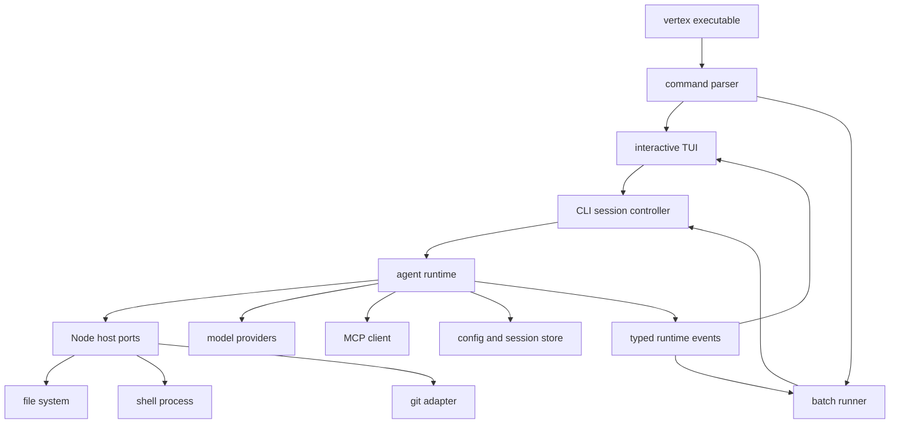

# Vertex CLI 完全替代 VS Code 扩展：开发达成路径

## 1. 决策与边界

目标是将项目发布物收敛为一个可安装、可交互和可脚本化的 Node.js coding-agent CLI：`vertex`。不再发布、维护或兼容 VS Code 扩展与 Webview。

首个可发布版本必须同时支持：

- `vertex`：交互式终端会话，提供流式回复、工具调用展示、审批、取消、会话恢复与斜杠命令。
- `vertex "任务描述"`：单次执行，适合本地自动化。
- `vertex run "任务描述" --output text|json|stream-json`：稳定的机器消费接口。
- `vertex auth`、`vertex config`、`vertex mcp`、`vertex resume`：最小可用的运维与会话命令。
- 以调用时当前目录或 `--cwd` 作为工作区；权限与忽略规则在 Node 环境内执行。

已有 CLI 基础应保留并扩展：`packages/types/src/cli.ts` 已定义 stdin 控制命令和 `stream-json` 事件模型，`packages/core/src/cli.ts` 已提供 CLI-safe 导出入口。它们应成为正式协议与核心包边界，而非另起协议。

## 2. 目标架构

### 包与职责

| 位置 | 职责 | 规则 |
| --- | --- | --- |
| `apps/cli/` | 可发布应用、参数解析、TUI、非交互渲染、安装脚本 | 不得导入 `vscode` |
| `packages/agent-runtime/` | `Task` 任务循环的去宿主化版本、事件、工具调度、上下文与审批状态机 | 不得导入 `vscode`，不得依赖 TUI |
| `packages/node-host/` | Node 文件、Shell、Git、配置、密钥、浏览器 OAuth、进程生命周期适配器 | 对外实现 runtime port |
| `packages/core/` | 通用消息、历史、工作树、自定义工具和无宿主算法 | 保持平台无关 |
| `packages/types/` | CLI 协议、运行时端口、配置、事件和序列化 schema | 是跨层唯一共享契约 |

不建议把新的 CLI 继续堆在 `src/`：该目录目前是 VS Code extension application，入口、构建与依赖都面向扩展。迁移完成后应删除该应用目录或将确实通用的实现移至新包。

## 3. 分阶段开发路径

### 阶段 A：建立可发布 CLI 骨架与契约

1. 新建 `apps/cli/` workspace package，声明 `bin` 为 `vertex`，使用 Node 20 ESM 构建产物。
2. 定义命令层：默认交互、`run`、`resume`、`auth`、`config`、`mcp`、`doctor`、`--cwd`、`--output`、`--yolo`、`--version` 和 `--help`。
3. 固化 `text`、`json`、`stream-json` 的输出规则：机器格式仅输出到 stdout；诊断、进度和日志仅输出到 stderr；退出码可判定成功、用户取消、配置错误、运行时错误。
4. 扩展 `packages/types/src/cli.ts`：补足启动元信息、审批请求/响应、会话标识、错误码、最终摘要与协议版本；每个 NDJSON 事件都必须可由 Zod 校验。
5. 将现有 `packages/core/src/cli.ts` 扩展为只导出 CLI 确实需要的通用能力，避免把 `src/` extension 模块重新暴露给 CLI。

验收：从仓库根目录运行 `pnpm --filter @vertex/cli exec vertex --help` 可展示命令；`run --output stream-json` 的每行均可通过 schema；没有 CLI 源文件解析或运行时加载 `vscode`。

### 阶段 B：先打通无 TUI 的最小 Agent 闭环

1. 在 `packages/agent-runtime/` 建立与 UI 无关的 `AgentSession`，取代当前 `Task` 对 `ClineProvider`、`ExtensionContext` 与 `TaskWebviewPort` 的直接依赖。
2. 将任务运行结果改为有序 typed event stream，至少覆盖：状态、assistant delta、thinking、tool request、tool progress、tool result、approval request、错误、最终结果、token/cost 和会话更新。
3. 先迁移模型 Provider、提示词构建、上下文压缩、消息队列、任务历史、待办与原生工具 schema；保持行为与现有 agent 任务循环一致。
4. 在 `packages/node-host/` 实现 Node 版端口：文件读写与搜索、Shell 子进程、Git、工作区路径、环境信息、进程取消和统一日志。
5. 将交互性从 Webview `ask` 消息改为 runtime `approval request` 事件。batch 命令由参数策略答复，交互命令以后由 TUI 答复。
6. 提供一条可测试的 headless runner，用固定 provider mock 覆盖“提示词 → 模型流 → 工具调用 → 审批 → 完成”。

验收：`vertex run "列出项目文件" --output text` 能在没有 VS Code 的环境完成；`--output json` 给出单个最终结果；Ctrl+C 终止模型流与子进程，退出码为取消；write、shell、MCP 等危险操作在未授权时不能执行。

### 阶段 C：去 VS Code 化所有宿主依赖

按下列依赖簇逐个迁移，每迁移一簇即删除其 `vscode` 引用并新增 Node host 测试，不允许在 runtime 中长期保留条件分支。

1. **状态与持久化**：将 `ExtensionContext.globalState`、`workspaceState` 与 `SecretStorage` 替换为 `XDG_CONFIG_HOME/vertex` 下的配置、profiles、加密凭证与 session store。Windows 使用 `APPDATA`，兼容环境变量覆盖。
2. **文件、路径与忽略**：将 `vscode.workspace.fs`、workspace folder、Uri 和文件搜索替换为 Node `fs/promises`、`path`、glob/ripgrep，以及现有 `.rooignore` 语义。
3. **终端与命令**：以 `child_process` 或 `execa` 实现跨平台执行、流输出、超时、取消和 process-tree 清理；删除 `TerminalRegistry`、shell integration 及 VS Code terminal profile 依赖。
4. **编辑器与 diff**：保留文本 diff 算法与 edit 工具；以 unified diff、文件修改摘要和可选外部 `$EDITOR` 替换 `DiffViewProvider`、装饰器、打开文件和 selection API。
5. **认证**：API key 读取 CLI profile/环境变量；浏览器 OAuth 改为 localhost callback 或 device flow；不得依赖 VS Code URI handler 和 SecretStorage。
6. **MCP、Skills、Marketplace 与 RAG**：将配置目录和 secret adapter 改为 Node host。优先保证 stdio MCP 与本地 skills，OAuth MCP、Marketplace、RAG 以独立命令接入并保留开关。
7. **checkpoints、worktree 与 diagnostics**：保留 Git checkpoint/worktree 能力，但通过 Git CLI/库和本地会话元数据实现；诊断改为命令输出和文件路径，不依赖 VS Code diagnostic collection。

验收：在仓库中执行全量 `vscode` import 搜索，运行时包和 CLI 包为零结果；`vertex doctor` 可检查 Node、Git、配置、认证与 MCP；核心能力在 Windows、macOS、Linux 的无 IDE shell 下可运行。

### 阶段 D：交互式 TUI

1. 用事件订阅渲染完整交互会话，不让终端组件反向调用模型、工具或文件系统。
2. 实现多行输入、历史导航、流式 Markdown、思考块折叠、工具卡片、实时 shell 输出、错误提示和成本/上下文状态条。
3. 实现审批面板：展示文件 diff、命令、工作目录、风险原因；支持 `y/n`、always allow、reject with feedback、取消当前任务。
4. 实现斜杠命令：`/help`、`/new`、`/resume`、`/mode`、`/model`、`/approve`、`/mcp`、`/compact`、`/diff`、`/exit`。
5. 首次启动使用 wizard 配置 Provider/profile；会话保存与恢复通过 session ID 和项目目录索引实现。
6. 非 TTY 或显式 `run` 时绝不初始化 TUI，保证 CI/管道行为稳定。

验收：`vertex` 在 TTY 打开交互界面；审批能阻断并准确恢复任务；`vertex resume` 能继续指定会话；同一 runtime 场景在 TUI 和 `stream-json` 下产生语义等价的事件序列。

### 阶段 E：收敛发布、迁移与删除

1. 将根 workspace、Turbo task、构建、测试、格式化与发布脚本切换为 CLI package；新增 npm package tarball 冒烟测试和跨平台安装测试。
2. 编写一次性迁移命令，将可安全迁移的 profiles、custom modes、rules、MCP 配置和会话数据从旧扩展存储导入 CLI 配置目录。凭证必须显式确认后导入。
3. 更新根 README、贡献指南、CI、许可证 notices 与 changelog，发布文档只描述 CLI。
4. 删除 VS Code 应用、Webview 前端、extension packaging 和 VS Code shim；最后运行依赖清理，删除只为扩展存在的依赖。

验收：`pnpm build`、`pnpm test`、`pnpm lint` 不调用 `vsce`、不构建 webview、也不需要 `@types/vscode`；打包产物通过干净目录安装后可运行 `vertex --version`、`vertex doctor` 和 mock `vertex run`。

## 4. 保留、迁移与删除清单

### 直接保留或优先迁移

- `packages/core/` 的消息合并、token 统计、任务历史、worktree 和 custom tools，尤其是 `packages/core/src/cli.ts`。
- `packages/types/` 的 provider、mode、MCP、task、tool、message、history、worktree 类型及 `packages/types/src/cli.ts` 的协议。
- 现有 Provider 适配器与模型流处理，迁移到 runtime/Node host 后保持 provider 配置兼容。
- Agent 核心能力：系统提示词、模式、自定义模式、skills、context management、condense、message queue、auto approval、task persistence、工具 schema、文件编辑、命令执行、MCP、Git checkpoint/worktree。
- `.rooignore`、项目规则、模式配置与任务历史的数据语义。

### 必须重构而非直接复用

- `src/core/task/Task.ts`：目前直接导入 `vscode`、`ClineProvider`、编辑器、终端与 checkpoint 服务。拆成 runtime 状态机、host ports 与事件投影；不要将现有 5000 多行类原样搬迁。
- `src/core/task/runtime/ports.ts`：移除 `vscode.ExtensionContext` 与 `TaskWebviewPort`，替换为 `RuntimeHostPort`、`EventSink`、`ConfigStore`、`SecretStore`、`WorkspacePort`、`ProcessPort`、`ApprovalPort`。
- `src/core/config/`、`src/utils/storage.ts`：改为 CLI 配置及 session repository。
- `src/services/mcp/`：改用 Node credential store、浏览器 OAuth 和本地 config loader。
- `src/services/code-index/`、`src/services/search/`：使用 Node watcher、glob/ripgrep 与 filesystem abstraction。
- `src/core/checkpoints/` 和 `src/services/checkpoints/`：保留行为，重写 VS Code URI、workspace 和 diff 展示接口。

### 可删除

- `src/extension.ts` 以及 `src/activate/`：扩展激活、VS Code command、code action、URI handler、terminal actions。
- `src/core/webview/`：`ClineProvider`、Webview 消息 handler、media handler、webview ports 及所有只服务 sidebar/tab panel 的测试。
- 根目录 `webview-ui/` 与 `src/webview-ui/`：React Webview、Vite、主题、Webview i18n、音频、Desmos、marketplace/settings/chat/history 页面。
- `src/integrations/editor/`：DiffViewProvider、DecorationController、编辑器选区/诊断/打开文件实现。
- `src/integrations/terminal/` 中仅用于 VS Code terminal/shell integration 的实现与测试。
- `src/api/providers/vscode-lm.ts`、`src/api/transform/vscode-lm-format.ts`、`src/shared/vsCodeSelectorUtils.ts`：VS Code Language Model provider。
- `packages/vscode-shim/`：CLI 完全替代后不再需要模拟 VS Code API。
- `src/package.json` 中所有 `contributes`、activation、VSIX、Marketplace 发布脚本及 `@types/vscode`、`@vscode/vsce`、`@vscode/test-electron`、`@vscode/codicons` 等纯扩展依赖。
- 根目录 `pack-vsix.bat`、extension 安装/发布脚本、`.vscodeignore` 及仅用于扩展市场的 manifest、图标和本地化资源。

## 5. 关键实施原则与风险控制

- **先增加，后删除**：每一项 CLI 能力先在新的 runtime/Node host 下通过测试，再删相应 VS Code 代码。不要先删 `src/` 再试图修复编译。
- **运行时禁用 shim**：不可使用 `packages/vscode-shim/` 作为正式 CLI 的长期过渡方案；shim 会把 API 债务隐藏在运行时。
- **协议先行**：事件 schema 与 exit code 在 TUI 开发前冻结；TUI、text、JSON 都只能消费它。
- **安全默认拒绝**：所有写文件、执行命令、网络敏感工具、MCP 写操作均需显式审批；仅 `--yolo` 或持久化 allowlist 可放宽。
- **持久化可迁移、凭证不默迁**：可迁移一般配置，敏感 token 必须重新授权或用户确认导入。
- **测试可脱离 TTY 与网络**：runtime 使用 mock provider 与 fake host；TUI 只测试事件渲染；真实 provider/MCP 走独立集成测试。

## 6. 总验收标准

1. npm 安装后，任意无 VS Code 环境可执行 `vertex`、`vertex run`、`vertex auth`、`vertex mcp`、`vertex resume` 与 `vertex doctor`。
2. 交互 TUI 能显示流式回复、工具调用、命令输出、审批、取消、错误和最终摘要。
3. `text`、`json`、`stream-json` 输出稳定：`stream-json` stdout 为逐行有效 JSON，stderr 不污染机器输出。
4. API key、OAuth、profiles、custom modes、rules、MCP 与会话在用户目录中独立持久化，不读取 VS Code 运行时。
5. 文件编辑、Shell、MCP、worktree/checkpoint、上下文压缩和历史恢复具备自动化覆盖。
6. repository 无 VS Code import、无 Webview 构建或 VSIX 发布链路、无 `packages/vscode-shim/` 运行时依赖。
7. CI 的 build、lint、typecheck、unit/integration tests 与 npm tarball smoke test 全部通过。
