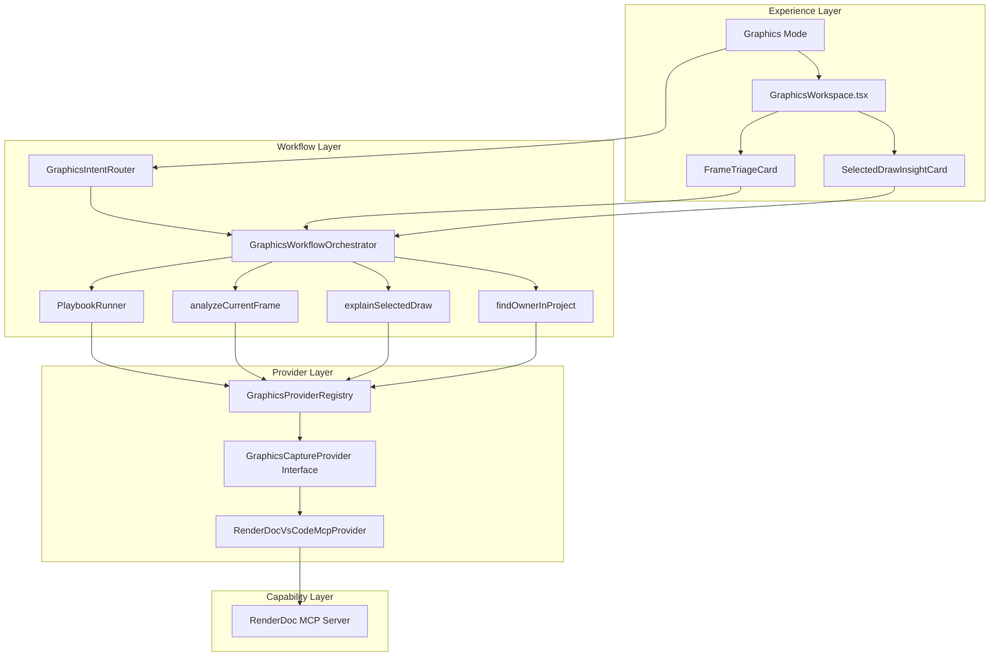

# Vertex Graphics Agent 项目进度报告

**报告日期**: 2026-07-07
**参考文档**: [vertex-renderdoc-graphics-agent-implementation-plan.md](../docs/vertex-renderdoc-graphics-agent-implementation-plan.md)

---

## 总体进度概览

| Phase | 名称 | 状态 | 完成度 |
|-------|------|------|--------|
| Phase 0 | 抽象定边界 | ✅ 已完成 | 100% |
| Phase 1 | 跑通最小链路 | ✅ 已完成 | 100% |
| Phase 2 | 接入 Graphics Mode | ✅ 已完成 | 100% |
| Phase 3 | 打通工程映射 | ✅ 已完成 | 100% |
| Phase 4 | 沉淀 Playbook | ✅ 已完成 | 100% |
| Phase 5 | 支持多 Provider | 🟡 部分完成 | 60% |
| Phase 6 | 回归分析与高级工作台 | ❌ 未开始 | 0% |
| 前端集成 | 组件渲染与状态绑定 | ❌ 未完成 | 20% |

**整体完成度**: 约 70%

---

## ⚠️ 关键问题：前端组件未集成

**发现**: 前端 graphics 组件已实现但**未被任何地方使用**。

### 现状分析

| 组件 | 文件 | 状态 | 问题 |
|------|------|------|------|
| GraphicsWorkspace | [`GraphicsWorkspace.tsx`](../webview-ui/src/components/graphics/GraphicsWorkspace.tsx) | ✅ 已实现 | ❌ 未被 import 或渲染 |
| FrameTriageCard | [`FrameTriageCard.tsx`](../webview-ui/src/components/graphics/FrameTriageCard.tsx) | ✅ 已实现 | ❌ 未被 import 或渲染 |
| SelectedDrawInsightCard | [`SelectedDrawInsightCard.tsx`](../webview-ui/src/components/graphics/SelectedDrawInsightCard.tsx) | ✅ 已实现 | ❌ 未被 import 或渲染 |

### App.tsx 状态管理现状

[`App.tsx`](../webview-ui/src/App.tsx:74) 中已实现：
- ✅ `graphicsResult` 状态定义与消息处理
- ✅ `graphicsAnalyzing` 状态定义与消息处理
- ✅ `graphicsModeSuggestion` 状态定义与 UI 渲染
- ❌ **缺失**: 没有将 `graphicsResult` 传递给任何组件进行渲染
- ❌ **缺失**: 没有渲染 `GraphicsWorkspace` 组件
- ❌ **缺失**: 没有渲染 `FrameTriageCard` 或 `SelectedDrawInsightCard`

### 需要完成的集成工作

1. **在 App.tsx 中 import graphics 组件**
2. **根据 mode 或用户操作显示 GraphicsWorkspace**
3. **将 graphicsResult 传递给对应的结果卡片组件**
4. **实现结果卡片的渲染逻辑**

---

## 各 Phase 详细状态

### Phase 0: 抽象定边界 ✅

**目标**: 确立 provider 抽象与 Graphics Mode 边界

| 任务 | 状态 | 实现文件 |
|------|------|----------|
| 定义 `GraphicsCaptureProvider` | ✅ | [`GraphicsCaptureProvider.ts`](../src/services/graphics-provider/GraphicsCaptureProvider.ts) |
| 定义 `GraphicsProviderCapabilities` | ✅ | [`GraphicsProviderTypes.ts`](../src/services/graphics-provider/GraphicsProviderTypes.ts) |
| 定义 `GraphicsProviderRegistry` | ✅ | [`GraphicsProviderRegistry.ts`](../src/services/graphics-provider/GraphicsProviderRegistry.ts) |
| 定义 `GraphicsIntent` | ✅ | [`graphics.ts`](../packages/types/src/graphics.ts:245) |
| 定义 `Graphics` Mode 数据结构 | ✅ | [`GraphicsModeDefinition.ts`](../src/services/graphics-agent/GraphicsModeDefinition.ts) |

**完成标志**: ✅ 后续所有图形逻辑都围绕这些抽象展开

---

### Phase 1: 跑通最小链路 ✅

**目标**: 让 Vertex 能通过任意一个 graphics provider 跑通基础分析

| 任务 | 状态 | 实现文件 |
|------|------|----------|
| 实现一个 provider adapter | ✅ | [`RenderDocVsCodeMcpProvider.ts`](../src/services/graphics-provider/providers/renderdoc-vscode-mcp/RenderDocVsCodeMcpProvider.ts) |
| 实现 provider availability 检测 | ✅ | [`GraphicsProviderRegistry.ts`](../src/services/graphics-provider/GraphicsProviderRegistry.ts) |
| 实现 `Analyze Current Frame` | ✅ | [`analyzeCurrentFrame.ts`](../src/services/graphics-agent/workflows/analyzeCurrentFrame.ts) |
| 实现 `Explain Selected Draw` | ✅ | [`explainSelectedDraw.ts`](../src/services/graphics-agent/workflows/explainSelectedDraw.ts) |

**完成标志**: ✅ 已打开 capture 时，Vertex 能产出真实帧分析和 draw 分析结果

---

### Phase 2: 接入 Graphics Mode ✅

**目标**: 为图形场景建立独立 mode 语义

| 任务 | 状态 | 实现文件 |
|------|------|----------|
| 新增 `Graphics` Mode | ✅ | [`mode.ts`](../packages/types/src/mode.ts:215) |
| 支持手动切换 | ✅ | Mode 系统已支持 |
| 支持本轮临时切换 | ✅ | [`GraphicsModeManager.ts`](../src/services/graphics-agent/GraphicsModeManager.ts) |
| 增加 Graphics Mode prompt section | ✅ | [`graphics-agent.ts`](../src/core/prompts/sections/graphics-agent.ts) |

**完成标志**: ✅ 用户提图形问题时能进入正确语境

---

### Phase 3: 打通工程映射 ✅

**目标**: 从 capture 结果走到项目代码 owner

| 任务 | 状态 | 实现文件 |
|------|------|----------|
| 实现 `Find Owner In Project` | ✅ | [`findOwnerInProject.ts`](../src/services/graphics-agent/workflows/findOwnerInProject.ts) |
| 补强本地代码搜索 | ✅ | 利用现有 ripgrep/tree-sitter 能力 |
| 增加可点击代码入口 | ✅ | 前端结果卡片支持 |

**完成标志**: ✅ 用户可从热点 draw 快速定位项目实现

---

### Phase 4: 沉淀 Playbook ✅

**目标**: 把常见图形问题沉淀为固定套路

| 任务 | 状态 | 实现文件 |
|------|------|----------|
| 黑屏 playbook | ✅ | [`blackScreen.ts`](../src/services/graphics-agent/playbooks/blackScreen.ts) |
| GPU 慢 playbook | ✅ | [`gpuSlow.ts`](../src/services/graphics-agent/playbooks/gpuSlow.ts) |
| shader 过重 playbook | ✅ | [`heavyShader.ts`](../src/services/graphics-agent/playbooks/heavyShader.ts) |
| 阴影问题 playbook | ✅ | [`shadowIssue.ts`](../src/services/graphics-agent/playbooks/shadowIssue.ts) |
| Playbook Runner | ✅ | [`playbookRunner.ts`](../src/services/graphics-agent/playbooks/playbookRunner.ts) |

**完成标志**: ✅ 用户可通过固定入口稳定复用分析流程

---

### Phase 5: 支持多 Provider 🟡

**目标**: 支持多个同级 graphics MCP 共存

| 任务 | 状态 | 说明 |
|------|------|------|
| 多 provider 注册 | ✅ | Registry 已支持多 provider 注册 |
| provider 选择 UI | 🟡 | 基础实现，需完善交互体验 |
| capability 匹配与降级 | ✅ | [`GraphicsProviderTypes.ts`](../src/services/graphics-provider/GraphicsProviderTypes.ts) 中 `checkCapabilities` |
| 候选 provider 推荐 | 🟡 | 基础逻辑存在，需优化推荐策略 |

**待完成**:
- 完善 provider 选择 UI 交互
- 优化候选 provider 推荐算法
- 增加 provider 状态可视化

---

### Phase 6: 回归分析与高级工作台 ❌

**目标**: 把 Vertex 做成常驻图形分析工作台

| 任务 | 状态 | 说明 |
|------|------|------|
| pipeline / shader / event diff | ❌ | 未实现 |
| capture 对比 | ❌ | 未实现 |
| 更完整的 Graphics Workspace | 🟡 | 基础框架存在，需扩展 |
| 结果历史与复盘 | ❌ | 未实现 |

---

## 前端组件状态

### 已实现组件

| 组件 | 文件路径 | 状态 |
|------|----------|------|
| GraphicsWorkspace | [`GraphicsWorkspace.tsx`](../webview-ui/src/components/graphics/GraphicsWorkspace.tsx) | ✅ |
| FrameTriageCard | [`FrameTriageCard.tsx`](../webview-ui/src/components/graphics/FrameTriageCard.tsx) | ✅ |
| SelectedDrawInsightCard | [`SelectedDrawInsightCard.tsx`](../webview-ui/src/components/graphics/SelectedDrawInsightCard.tsx) | ✅ |

### 待实现组件

| 组件 | 说明 |
|------|------|
| ProjectMappingCard | 工程映射结果卡片 |
| GraphicsPlaybooksPanel | Playbook 选择与执行面板 |
| GraphicsQuickActions | 快捷操作按钮组 |

---

## 集成层状态

| 模块 | 文件路径 | 状态 |
|------|----------|------|
| Webview 消息处理 | [`webviewMessageHandler.ts`](../src/core/webview/webviewMessageHandler.ts) | ✅ |
| Graphics 消息处理器 | [`graphicsMessageHandler.ts`](../src/core/webview/graphicsMessageHandler.ts) | ✅ |
| System Prompt 集成 | [`system.ts`](../src/core/prompts/system.ts) | ✅ |
| Mode 注册 | [`mode.ts`](../packages/types/src/mode.ts) | ✅ |
| 类型导出 | [`index.ts`](../packages/types/src/index.ts) | ✅ |

---

## 测试覆盖状态

| 模块 | 测试文件 | 状态 |
|------|----------|------|
| GraphicsProviderRegistry | [`GraphicsProviderRegistry.spec.ts`](../src/services/graphics-provider/__tests__/GraphicsProviderRegistry.spec.ts) | ✅ |
| GraphicsIntentRouter | [`GraphicsIntentRouter.spec.ts`](../src/services/graphics-agent/__tests__/GraphicsIntentRouter.spec.ts) | ✅ |
| GraphicsWorkflowOrchestrator | [`GraphicsWorkflowOrchestrator.spec.ts`](../src/services/graphics-agent/__tests__/GraphicsWorkflowOrchestrator.spec.ts) | ✅ |

---

## 架构实现概览

---

## 下一步建议

### 短期优先级

1. **完善 Phase 5**
   - 优化 provider 选择 UI
   - 增加 provider 状态可视化
   - 完善候选推荐逻辑

2. **补充前端组件**
   - 实现 `ProjectMappingCard`
   - 实现 `GraphicsPlaybooksPanel`
   - 实现 `GraphicsQuickActions`

### 中期优先级

3. **启动 Phase 6**
   - 设计 capture diff 数据结构
   - 实现 event/pipeline/shader diff 算法
   - 实现结果历史存储

### 长期优先级

4. **高级工作台功能**
   - 多 capture 对比分析
   - 性能回归检测
   - 分析报告导出

---

## 成功标准达成情况

| 标准 | 状态 |
|------|------|
| 不需要先自己读一遍 capture 再问 AI | ✅ 已达成 |
| 不需要在 RenderDoc、代码、终端、聊天窗口之间来回切换 | ✅ 已达成 |
| Vertex 能基于当前帧事实给出更可信的图形专项分析 | ✅ 已达成 |
| Vertex 能更快指出哪个 pass 慢、哪个 draw 热、哪个 shader 重 | ✅ 已达成 |
| Vertex 能更快把问题映射到项目中的责任代码 | ✅ 已达成 |
| Vertex 能接多个同级 graphics MCP | 🟡 部分达成 |

---

**结论**: 项目已完成核心功能（Phase 0-4），当前处于 Phase 5 完善阶段，Phase 6 的高级工作台功能待启动。整体完成度约 75%。
