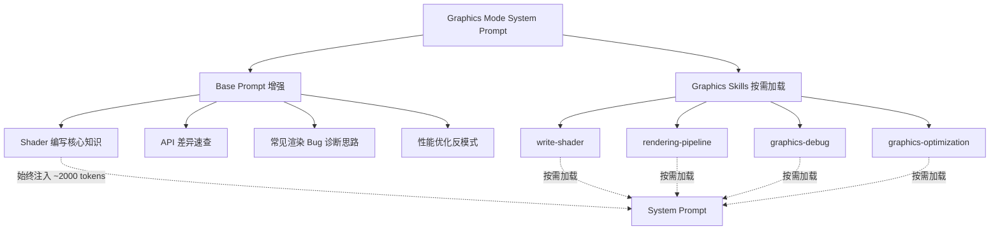

# Graphics Mode 无 Provider 增强计划

## 目标

让 Graphics Mode 在没有配置 Graphics Providers 的情况下，也能像一个经验丰富的图形程序员一样工作——写 Shader、修改管线、实现新 Feature、调试渲染 Bug。

## 架构设计

## 分工原则

| 层级 | 内容 | 加载方式 | 目的 |
|------|------|----------|------|
| Base Prompt | 核心图形学知识、API 术语、常见模式 | 始终注入 | 让 AI 像一个有经验的图形程序员 |
| Skills | 具体工作流、步骤化指导、代码模板 | 按需加载 | 提供结构化的任务执行流程 |

## 实施步骤

### Step 1: 增强 graphics-agent.ts Base Prompt

**文件**: `src/core/prompts/sections/graphics-agent.ts`

在现有 `GRAPHICS_MODE_PROMPT` 末尾追加以下知识模块：

#### 1.1 Shader 编写核心知识
- PBR 光照模型（Cook-Torrance BRDF、GGX、Schlick Fresnel、Smith G）
- 常见后处理算法（Bloom、SSAO、SSR、TAA、Tone Mapping）
- 计算着色器模式（粒子系统、GPU Culling、Indirect Draw）
- Shader 编码最佳实践（精度选择、分支优化、纹理采样策略）

#### 1.2 API 差异速查
- D3D12 vs Vulkan vs OpenGL 关键差异
- 资源绑定模型对比（Descriptor Heap vs Descriptor Set vs Bindless）
- 屏障/同步模型差异
- 管线状态对象差异

#### 1.3 常见渲染 Bug 代码级诊断
- 黑屏：Clear 操作、Viewport/Scissor、Shader 输出、Render Target 绑定
- 花屏/闪烁：Z-fighting、Barrier 缺失、未初始化资源、精度问题
- 阴影问题：Depth Bias、Cascade Splits、Shadow Map 分辨率
- 光照错误：法线空间不一致、Gamma/Linear 混淆、HDR 溢出

#### 1.4 性能优化反模式
- 过度绘制（Overdraw）
- 带宽浪费（RenderTarget 格式、Mipmap 缺失）
- Shader 寄存器压力
- 不必要的状态切换
- GPU/CPU 同步点

### Step 2: 创建 Graphics Skills

**目录**: `.roo/skills-graphics/`

#### 2.1 write-shader Skill
- **触发**: 用户要写新 Shader 或修改现有 Shader
- **工作流**: 需求收集 → Shader 类型选择 → 编写代码 → 优化建议 → 集成指导
- **包含**: 常见 Shader 模板（PBR、后处理、计算着色器、天空盒等）

#### 2.2 rendering-pipeline Skill
- **触发**: 用户要修改渲染管线、添加新 Pass、重构渲染器
- **工作流**: 理解现有管线 → 设计方案 → 实现步骤 → 集成测试
- **包含**: 常见管线架构模式（Forward、Deferred、Forward+、Tile-Based）

#### 2.3 graphics-debug Skill
- **触发**: 用户有渲染 Bug 需要排查
- **工作流**: 问题分类 → 代码审查清单 → 逐步排除 → 修复方案
- **包含**: 各类渲染 Bug 的系统化排查清单

#### 2.4 graphics-optimization Skill
- **触发**: 用户要优化渲染性能
- **工作流**: 性能预算 → 瓶颈分析 → 优化策略 → 代码改造
- **包含**: 常见优化技术和性能预算参考

### Step 3: 更新 GraphicsModeDefinition.ts

**文件**: `src/services/graphics-agent/GraphicsModeDefinition.ts`

- 增强 `roleDefinition`：强调代码编写能力，不仅限于 capture 分析
- 增强 `customInstructions`：添加无 Provider 时的行为指导
- 更新 `whenToUse`：扩展触发场景，包含写 Shader、修改管线等

### Step 4: 验证

- 确认 Skills 在 Graphics Mode 下正确加载
- 确认 Base Prompt 增强不影响有 Provider 时的行为
- 确认 Skills 的 modeSlugs 正确设置为 `["graphics"]`

## 文件变更清单

| 文件 | 操作 | 说明 |
|------|------|------|
| `src/core/prompts/sections/graphics-agent.ts` | 修改 | 追加图形学知识库 |
| `.roo/skills-graphics/write-shader/SKILL.md` | 新建 | Shader 编写 Skill |
| `.roo/skills-graphics/rendering-pipeline/SKILL.md` | 新建 | 管线设计 Skill |
| `.roo/skills-graphics/graphics-debug/SKILL.md` | 新建 | 渲染调试 Skill |
| `.roo/skills-graphics/graphics-optimization/SKILL.md` | 新建 | 性能优化 Skill |
| `src/services/graphics-agent/GraphicsModeDefinition.ts` | 修改 | 增强角色定义和指令 |
