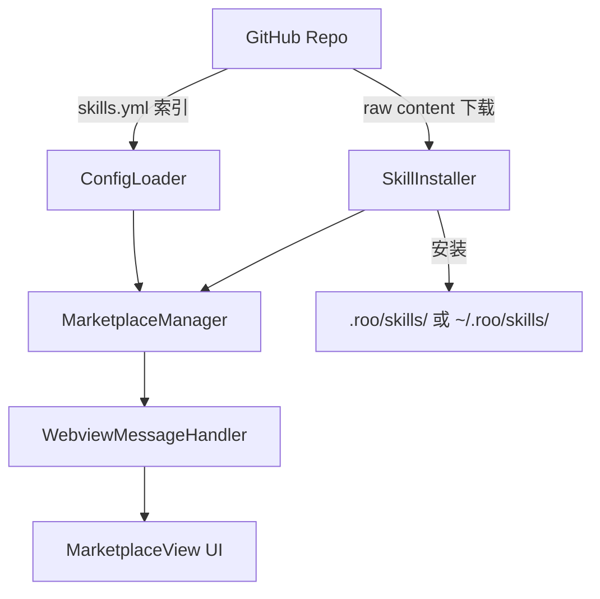
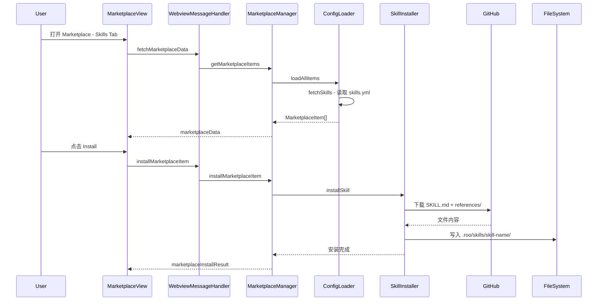

# Marketplace Skills 品类实施计划

## 目标

为 Vertex 插件的 Marketplace 添加 "Skill" 品类，允许用户浏览、安装和卸载社区贡献的 Agent Skills。Skills 托管在 GitHub 上，用户通过 Marketplace UI 一键安装到本地项目或全局目录。

## 架构总览



## 数据流



## 实施步骤

### Step 1: 扩展类型定义

**文件**: `packages/types/src/marketplace.ts`

```typescript
// 1. 扩展 MarketplaceItemType
export const marketplaceItemTypeSchema = z.enum(["mode", "mcp", "skill"] as const)

// 2. 新增 Skill 文件描述 schema
export const skillFileSchema = z.object({
  path: z.string().min(1),        // 相对路径，如 "SKILL.md", "references/debug-playbook.md"
  url: z.string().url().optional(), // 可选的直接下载 URL，覆盖 source 推导
})

// 3. 新增 Skill Marketplace Item schema
export const skillMarketplaceItemSchema = baseMarketplaceItemSchema.extend({
  source: z.string().url(),        // GitHub 仓库 URL，如 "https://github.com/user/repo"
  sourcePath: z.string().optional(), // 仓库内路径前缀，默认 ""
  branch: z.string().optional().default("main"), // 分支名
  files: z.array(skillFileSchema).min(1), // 需要下载的文件列表
  modeSlugs: z.array(z.string()).optional(), // 适用的 Mode 列表
})

// 4. 更新 discriminated union
export const marketplaceItemSchema = z.discriminatedUnion("type", [
  modeMarketplaceItemSchema.extend({ type: z.literal("mode") }),
  mcpMarketplaceItemSchema.extend({ type: z.literal("mcp") }),
  skillMarketplaceItemSchema.extend({ type: z.literal("skill") }),
])
```

### Step 2: 创建 skills.yml 数据文件

**文件**: `src/assets/marketplace/skills.yml`

```yaml
items:
  - id: write-shader
    name: Write Shader
    description: "编写、修改和优化 GPU Shader 代码。支持 HLSL、GLSL、WGSL、MSL。包含 PBR、后处理、计算着色器等模板。"
    author: "@vertex"
    authorUrl: "https://github.com/anthropics/vertex"
    tags:
      - shader
      - graphics
      - hlsl
      - glsl
      - pbr
    source: "https://github.com/anthropics/vertex-skills"
    sourcePath: "graphics/write-shader"
    branch: "main"
    files:
      - path: "SKILL.md"
      - path: "references/pbr-reference.md"
    modeSlugs:
      - graphics
      - code

  - id: rendering-pipeline
    name: Rendering Pipeline
    description: "设计和修改渲染管线。支持 Forward、Deferred、Forward+ 等架构模式。"
    author: "@vertex"
    tags:
      - pipeline
      - graphics
      - rendering
    source: "https://github.com/anthropics/vertex-skills"
    sourcePath: "graphics/rendering-pipeline"
    branch: "main"
    files:
      - path: "SKILL.md"
    modeSlugs:
      - graphics
      - code

  - id: graphics-debug
    name: Graphics Debug
    description: "代码级渲染 Bug 调试。系统化排查黑屏、花屏、闪烁、光照异常等问题。"
    author: "@vertex"
    tags:
      - debug
      - graphics
      - troubleshooting
    source: "https://github.com/anthropics/vertex-skills"
    sourcePath: "graphics/graphics-debug"
    branch: "main"
    files:
      - path: "SKILL.md"
      - path: "references/debug-playbook.md"
    modeSlugs:
      - graphics
      - code

  - id: graphics-optimization
    name: Graphics Optimization
    description: "渲染性能优化。包含性能预算、瓶颈分析、优化技术决策矩阵。"
    author: "@vertex"
    tags:
      - optimization
      - graphics
      - performance
    source: "https://github.com/anthropics/vertex-skills"
    sourcePath: "graphics/graphics-optimization"
    branch: "main"
    files:
      - path: "SKILL.md"
    modeSlugs:
      - graphics
      - code
```

### Step 3: 更新 ConfigLoader

**文件**: `src/services/marketplace/ConfigLoader.ts`

新增 `fetchSkills()` 方法，与 `fetchModes()` 和 `fetchMcps()` 并行加载：

```typescript
// 新增 schema
const skillMarketplaceResponse = z.object({
  items: z.array(skillMarketplaceItemSchema),
})

// 修改 loadAllItems
async loadAllItems(): Promise<MarketplaceItem[]> {
  const [modes, mcps, skills] = await Promise.all([
    this.fetchModes(),
    this.fetchMcps(),
    this.fetchSkills(),
  ])
  return [...modes, ...mcps, ...skills]
}

// 新增 fetchSkills
private async fetchSkills(): Promise<MarketplaceItem[]> {
  const data = await this.readMarketplaceFile("skills.yml")
  const yamlData = yaml.parse(data)
  const validated = skillMarketplaceResponse.parse(yamlData)
  return validated.items.map((item) => ({
    type: "skill" as const,
    ...item,
  }))
}
```

### Step 4: 实现 SkillInstaller

**文件**: `src/services/marketplace/SkillInstaller.ts`（新建）

核心逻辑：从 GitHub 下载 Skill 文件并写入本地目录。

```typescript
export class SkillInstaller {
  // 安装 Skill
  async installSkill(item: MarketplaceItem, target: "project" | "global"): Promise<{ dirPath: string }> {
    // 1. 确定安装目录
    const baseDir = target === "project"
      ? path.join(workspaceFolder, ".roo", "skills")
      : path.join(globalRooDir, "skills")

    // 如果有 modeSlugs，安装到 skills-{firstMode}/ 目录
    const modeSlug = item.modeSlugs?.[0]
    const skillsDir = modeSlug
      ? path.join(baseDir.replace("/skills", ""), `skills-${modeSlug}`)
      : baseDir

    const skillDir = path.join(skillsDir, item.id)

    // 2. 下载所有文件
    for (const file of item.files) {
      const rawUrl = this.buildRawUrl(item.source, item.branch, item.sourcePath, file.path, file.url)
      const content = await this.downloadFile(rawUrl)
      const filePath = path.join(skillDir, file.path)
      await fs.mkdir(path.dirname(filePath), { recursive: true })
      await fs.writeFile(filePath, content, "utf-8")
    }

    return { dirPath: skillDir }
  }

  // 构建 GitHub raw URL
  private buildRawUrl(source: string, branch: string, sourcePath: string, filePath: string, directUrl?: string): string {
    if (directUrl) return directUrl
    // https://github.com/user/repo → https://raw.githubusercontent.com/user/repo/main/path/file
    const repoPath = source.replace("https://github.com/", "")
    const prefix = sourcePath ? `${sourcePath}/` : ""
    return `https://raw.githubusercontent.com/${repoPath}/${branch || "main"}/${prefix}${filePath}`
  }

  // 下载文件
  private async downloadFile(url: string): Promise<string> {
    const response = await fetch(url)
    if (!response.ok) throw new Error(`Failed to download: ${url} (${response.status})`)
    return response.text()
  }

  // 卸载 Skill
  async removeSkill(item: MarketplaceItem, target: "project" | "global"): Promise<void> {
    // 删除 skill 目录
    const skillDir = this.getSkillDir(item, target)
    await fs.rm(skillDir, { recursive: true, force: true })
  }
}
```

### Step 5: 更新 SimpleInstaller

**文件**: `src/services/marketplace/SimpleInstaller.ts`

在 `installItem` 和 `removeItem` 的 switch 中添加 `"skill"` case：

```typescript
async installItem(item: MarketplaceItem, options: InstallOptions) {
  switch (item.type) {
    case "mode": return await this.installMode(item, target)
    case "mcp": return await this.installMcp(item, target, options)
    case "skill": return await this.installSkill(item, target)  // 新增
    default: throw new Error(`Unsupported item type: ${item.type}`)
  }
}

private async installSkill(item: MarketplaceItem, target: "project" | "global") {
  const result = await this.skillInstaller.installSkill(item, target)
  return { filePath: result.dirPath }
}
```

### Step 6: 更新前端 UI

**文件**: `webview-ui/src/components/marketplace/MarketplaceViewStateManager.ts`

```typescript
// 扩展 activeTab 类型
activeTab: "mcp" | "mode" | "skill"
```

**文件**: `webview-ui/src/components/marketplace/MarketplaceView.tsx`

添加 Skill Tab 按钮和对应的 ListView：

```tsx
{/* 新增 Skill Tab */}
<Button
  variant={state.activeTab === "skill" ? "default" : "ghost"}
  onClick={() => manager.setActiveTab("skill")}
>
  {t("marketplace:filters.type.skill")}
</Button>

{/* 新增 Skill ListView */}
{state.activeTab === "skill" && (
  <MarketplaceListView
    stateManager={stateManager}
    allTags={allTags}
    filteredTags={filteredTags}
    filterByType="skill"
  />
)}
```

**文件**: `webview-ui/src/components/marketplace/components/MarketplaceItemCard.tsx`

在 typeLabel 映射中添加 "skill"：

```typescript
const labels: Partial<Record<MarketplaceItem["type"], string>> = {
  mode: t("marketplace:filters.type.mode"),
  mcp: t("marketplace:filters.type.mcpServer"),
  skill: t("marketplace:filters.type.skill"),  // 新增
}
```

### Step 7: 添加国际化文本

在 marketplace 翻译文件中添加：

```json
{
  "filters": {
    "type": {
      "skill": "Skill"
    },
    "search": {
      "placeholderSkill": "Search skills..."
    }
  },
  "install": {
    "titleSkill": "Install Skill: {{name}}",
    "whatNextSkill": "The skill has been installed. It will be available in the specified modes."
  },
  "removeConfirm": {
    "skill": {
      "title": "Remove Skill",
      "message": "Are you sure you want to remove the skill '{{skillName}}'?"
    }
  }
}
```

### Step 8: 更新安装元数据检测

**文件**: `src/services/marketplace/MarketplaceManager.ts`

更新 `getInstallationMetadata()` 以检测已安装的 Skills：

```typescript
// 检查 .roo/skills/ 和 .roo/skills-{mode}/ 目录下是否有匹配的 skill 目录
private async getSkillInstallationMetadata(items: MarketplaceItem[]) {
  const metadata: Record<string, { type: string }> = {}
  for (const item of items.filter(i => i.type === "skill")) {
    // 检查 project 和 global 目录
    const projectDir = path.join(cwd, ".roo", "skills", item.id)
    const globalDir = path.join(globalRooDir, "skills", item.id)
    if (await dirExists(projectDir)) metadata[item.id] = { type: "skill" }
    if (await dirExists(globalDir)) metadata[item.id] = { type: "skill" }
  }
  return metadata
}
```

## GitHub 仓库结构

用户可以将 Skills 上传到任意 GitHub 仓库，只要遵循以下结构：

```
my-vertex-skills/
├── graphics/
│   ├── write-shader/
│   │   ├── SKILL.md
│   │   └── references/
│   │       └── pbr-reference.md
│   ├── rendering-pipeline/
│   │   └── SKILL.md
│   ├── graphics-debug/
│   │   ├── SKILL.md
│   │   └── references/
│   │       └── debug-playbook.md
│   └── graphics-optimization/
│       └── SKILL.md
├── web-dev/
│   ├── react-component/
│   │   └── SKILL.md
│   └── api-design/
│       └── SKILL.md
└── README.md
```

## 文件变更清单

| 文件 | 操作 | 说明 |
|------|------|------|
| `packages/types/src/marketplace.ts` | 修改 | 添加 "skill" 类型和 skillMarketplaceItemSchema |
| `src/assets/marketplace/skills.yml` | 新建 | Skill 品类数据文件 |
| `src/services/marketplace/ConfigLoader.ts` | 修改 | 添加 fetchSkills() |
| `src/services/marketplace/SkillInstaller.ts` | 新建 | Skill 安装/卸载逻辑 |
| `src/services/marketplace/SimpleInstaller.ts` | 修改 | 添加 skill case |
| `src/services/marketplace/MarketplaceManager.ts` | 修改 | 添加 Skill 安装元数据检测 |
| `webview-ui/src/components/marketplace/MarketplaceViewStateManager.ts` | 修改 | 扩展 activeTab 类型 |
| `webview-ui/src/components/marketplace/MarketplaceView.tsx` | 修改 | 添加 Skill Tab |
| `webview-ui/src/components/marketplace/components/MarketplaceItemCard.tsx` | 修改 | 添加 skill typeLabel |
| `webview-ui/src/i18n/locales/*/marketplace.json` | 修改 | 添加 Skill 相关翻译 |
