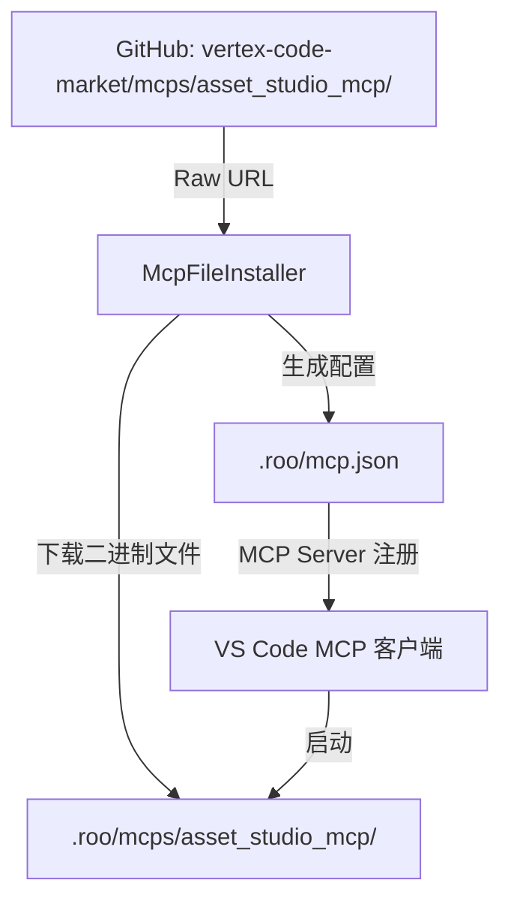

# MCP 文件下载支持实施计划

## 📋 概述

### 目标
扩展 Marketplace MCP 系统，支持从 GitHub 仓库下载二进制文件（如 .NET 应用），使 `asset_studio_mcp` 可以通过 Marketplace 安装。

### 背景
当前 MCP marketplace 仅支持 JSON 配置（npx/docker 命令），不支持文件下载。而 `vertex-code-market/mcps/asset_studio_mcp/` 是一个完整的 .NET 应用，包含可执行文件和 DLL 依赖，需要下载到本地才能运行。

### 方案
复用 Skill/Knowledge 的 `source`/`sourcePath`/`files` 机制，扩展 MCP Schema 支持文件下载。

---

## 🏗️ 架构设计

### 数据流



### 安装目录结构

```
.roo/
├── mcp.json                          # MCP 配置（指向本地可执行文件）
└── mcps/
    └── asset_studio_mcp/             # 下载的 MCP 服务器文件
        ├── AssetStudio.McpServer.exe
        ├── AssetStudio.McpServer.dll
        ├── *.dll                     # 依赖 DLL
        └── runtimes/
            └── win/lib/net6.0/
                └── *.dll
```

---

## 📝 实施步骤

### 步骤 1：扩展 MCP Schema

**文件**: [`packages/types/src/marketplace.ts`](packages/types/src/marketplace.ts:56)

**变更内容**:

```typescript
// 新增 MCP 文件 schema（复用 skillFileSchema）
export const mcpFileSchema = skillFileSchema
export type McpFile = z.infer<typeof mcpFileSchema>

// 扩展 mcpMarketplaceItemSchema
export const mcpMarketplaceItemSchema = baseMarketplaceItemSchema.extend({
    url: z.string().url().optional(),  // 改为 optional，支持文件下载模式
    content: z.union([z.string().min(1), z.array(mcpInstallationMethodSchema)]).optional(),  // 改为 optional
    parameters: z.array(mcpParameterSchema).optional(),
    // 新增文件下载支持字段
    source: z.string().url().optional(),      // GitHub 仓库 URL
    sourcePath: z.string().optional().default(""),  // 仓库内路径
    branch: z.string().optional().default("main"),  // Git 分支
    files: z.array(mcpFileSchema).optional(),       // 文件列表
    executable: z.string().optional(),              // 可执行文件相对路径
})
```

**设计说明**:
- `url` 和 `content` 改为 optional，支持两种模式：
  - **配置模式**（现有）：提供 `url` + `content`，写入 JSON 配置
  - **文件下载模式**（新增）：提供 `source` + `files`，下载文件并生成配置
- `executable` 字段指定下载后的可执行文件路径（相对于安装目录）

---

### 步骤 2：创建 McpFileInstaller

**文件**: `src/services/marketplace/McpFileInstaller.ts`（新建）

**核心功能**:

```typescript
export class McpFileInstaller {
    /**
     * 安装基于文件的 MCP 服务器
     * 1. 从 GitHub 下载所有文件到 .roo/mcps/{id}/
     * 2. 生成 mcp.json 配置指向本地可执行文件
     */
    async installMcpWithFiles(item: MarketplaceItem, target: "project" | "global"): Promise<McpInstallResult>

    /**
     * 卸载基于文件的 MCP 服务器
     * 1. 删除 .roo/mcps/{id}/ 目录
     * 2. 从 mcp.json 中移除配置
     */
    async removeMcpWithFiles(item: MarketplaceItem, target: "project" | "global"): Promise<void>

    /**
     * 检查是否已安装
     */
    async isInstalled(item: MarketplaceItem, target: "project" | "global"): Promise<boolean>

    // 私有方法
    private buildRawUrl(source: string, branch: string, sourcePath: string, file: McpFile): string
    private async downloadBinaryFile(url: string): Promise<Buffer>  // 支持二进制下载
    private async getMcpDirectory(target: "project" | "global", mcpId: string): Promise<string>
    private generateMcpConfig(item: MarketplaceItem, installDir: string): object
}
```

**关键实现细节**:

1. **二进制文件下载**:
   ```typescript
   private async downloadBinaryFile(url: string): Promise<Buffer> {
       const response = await fetch(url)
       if (!response.ok) {
           throw new Error(`Failed to download: ${url} (HTTP ${response.status})`)
       }
       return Buffer.from(await response.arrayBuffer())
   }
   ```

2. **文件写入**:
   ```typescript
   // 根据文件扩展名决定写入模式
   const isBinary = file.path.endsWith('.exe') || file.path.endsWith('.dll') || file.path.endsWith('.pdb')
   if (isBinary) {
       await fs.writeFile(filePath, content, 'binary')
   } else {
       await fs.writeFile(filePath, content, 'utf-8')
   }
   ```

3. **生成 MCP 配置**:
   ```typescript
   private generateMcpConfig(item: MarketplaceItem, installDir: string): object {
       const executablePath = path.join(installDir, item.executable || 'server.exe')
       return {
           command: executablePath,
           args: [],
           env: {}
       }
   }
   ```

---

### 步骤 3：修改 SimpleInstaller

**文件**: [`src/services/marketplace/SimpleInstaller.ts`](src/services/marketplace/SimpleInstaller.ts:190)

**变更内容**:

```typescript
export class SimpleInstaller {
    private readonly skillInstaller: SkillInstaller
    private readonly knowledgeInstaller: KnowledgeInstaller
    private readonly mcpFileInstaller: McpFileInstaller  // 新增

    constructor(...) {
        this.skillInstaller = new SkillInstaller()
        this.knowledgeInstaller = new KnowledgeInstaller()
        this.mcpFileInstaller = new McpFileInstaller()  // 新增
    }

    private async installMcp(
        item: Extract<MarketplaceItem, { type: "mcp" }>,
        target: "project" | "global",
        options?: InstallOptions,
    ): Promise<{ filePath: string; line?: number }> {
        // 判断是否为文件下载模式
        if (item.source && item.files && item.files.length > 0) {
            // 使用 McpFileInstaller 处理文件下载
            return await this.mcpFileInstaller.installMcpWithFiles(item, target)
        }

        // 原有的配置模式逻辑保持不变
        // ... existing code ...
    }

    async removeItem(item: MarketplaceItem, options: InstallOptions): Promise<void> {
        // ...
        case "mcp":
            if (item.source && item.files && item.files.length > 0) {
                await this.mcpFileInstaller.removeMcpWithFiles(item, target)
            } else {
                await this.removeMcp(item, target)
            }
            break
        // ...
    }
}
```

---

### 步骤 4：更新 MarketplaceManager 安装检测

**文件**: [`src/services/marketplace/MarketplaceManager.ts`](src/services/marketplace/MarketplaceManager.ts:210)

**变更内容**:

在 `checkProjectInstallations` 和 `checkGlobalInstallations` 中添加对文件型 MCP 的检测：

```typescript
private async checkProjectInstallations(metadata: Record<string, { type: string }>): Promise<void> {
    // ... existing code ...

    // 检查文件型 MCP 在 .roo/mcps/
    const mcpsDir = path.join(workspaceFolder.uri.fsPath, ".roo", "mcps")
    try {
        const entries = await fs.readdir(mcpsDir, { withFileTypes: true })
        for (const entry of entries) {
            if (entry.isDirectory()) {
                metadata[entry.name] = { type: "mcp" }
            }
        }
    } catch (error) {
        // 目录不存在，跳过
    }
}
```

---

### 步骤 5：在 mcps.yml 中添加 asset_studio_mcp 条目

**文件**: [`src/assets/marketplace/mcps.yml`](src/assets/marketplace/mcps.yml:1)

**新增内容**:

```yaml
  - id: asset-studio-mcp
    name: Asset Studio MCP
    description: |
      Unity 资源提取 MCP 服务器。基于 AssetStudio，支持从 Unity 项目中提取纹理、模型、音频等资源。
      提供资源浏览、搜索、预览和导出功能。
    author: "@Kirkice"
    authorUrl: "https://github.com/Kirkice"
    tags:
      - unity
      - asset-extraction
      - texture
      - model
      - audio
      - mcp
    source: "https://github.com/Kirkice/vertex-code-market"
    sourcePath: "mcps/asset_studio_mcp"
    branch: "main"
    executable: "AssetStudio.McpServer.exe"
    files:
      # 主程序
      - path: "AssetStudio.McpServer.exe"
      - path: "AssetStudio.McpServer.dll"
      - path: "AssetStudio.McpServer.deps.json"
      - path: "AssetStudio.McpServer.runtimeconfig.json"
      # 核心依赖
      - path: "AssetStudio.dll"
      - path: "AssetStudio.PInvoke.dll"
      - path: "AssetStudio.Utility.dll"
      - path: "AssetStudioFBXNative.dll"
      - path: "AssetStudioFBXWrapper.dll"
      - path: "Texture2DDecoderNative.dll"
      - path: "Texture2DDecoderWrapper.dll"
      # .NET 运行时依赖
      - path: "Microsoft.Extensions.Hosting.dll"
      - path: "Microsoft.Extensions.Hosting.Abstractions.dll"
      - path: "Microsoft.Extensions.DependencyInjection.dll"
      - path: "Microsoft.Extensions.DependencyInjection.Abstractions.dll"
      - path: "Microsoft.Extensions.Logging.dll"
      - path: "Microsoft.Extensions.Logging.Abstractions.dll"
      - path: "Microsoft.Extensions.Logging.Console.dll"
      - path: "Microsoft.Extensions.Logging.Debug.dll"
      - path: "Microsoft.Extensions.Logging.Configuration.dll"
      - path: "Microsoft.Extensions.Configuration.dll"
      - path: "Microsoft.Extensions.Configuration.Abstractions.dll"
      - path: "Microsoft.Extensions.Configuration.Binder.dll"
      - path: "Microsoft.Extensions.Configuration.CommandLine.dll"
      - path: "Microsoft.Extensions.Configuration.EnvironmentVariables.dll"
      - path: "Microsoft.Extensions.Configuration.FileExtensions.dll"
      - path: "Microsoft.Extensions.Configuration.Json.dll"
      - path: "Microsoft.Extensions.Configuration.UserSecrets.dll"
      - path: "Microsoft.Extensions.FileProviders.Abstractions.dll"
      - path: "Microsoft.Extensions.FileProviders.Physical.dll"
      - path: "Microsoft.Extensions.FileSystemGlobbing.dll"
      - path: "Microsoft.Extensions.Options.dll"
      - path: "Microsoft.Extensions.Options.ConfigurationExtensions.dll"
      - path: "Microsoft.Extensions.Primitives.dll"
      - path: "Microsoft.Extensions.Diagnostics.dll"
      - path: "Microsoft.Extensions.Diagnostics.Abstractions.dll"
      - path: "Microsoft.Bcl.AsyncInterfaces.dll"
      - path: "Microsoft.Bcl.Memory.dll"
      # MCP 协议
      - path: "ModelContextProtocol.dll"
      - path: "ModelContextProtocol.Core.dll"
      # 第三方依赖
      - path: "Newtonsoft.Json.dll"
      - path: "SixLabors.Fonts.dll"
      - path: "SixLabors.ImageSharp.dll"
      - path: "SixLabors.ImageSharp.Drawing.dll"
      - path: "K4os.Compression.LZ4.dll"
      - path: "Mono.Cecil.dll"
      - path: "Mono.Cecil.Mdb.dll"
      - path: "Mono.Cecil.Pdb.dll"
      - path: "Mono.Cecil.Rocks.dll"
      # 系统依赖
      - path: "System.Diagnostics.DiagnosticSource.dll"
      - path: "System.IO.Pipelines.dll"
      - path: "System.Net.ServerSentEvents.dll"
      - path: "System.Text.Encodings.Web.dll"
      - path: "System.Text.Json.dll"
      - path: "System.Threading.Channels.dll"
      # Windows 运行时
      - path: "runtimes/win/lib/net6.0/System.Diagnostics.EventLog.dll"
      - path: "runtimes/win/lib/net6.0/System.Diagnostics.EventLog.Messages.dll"
      # README
      - path: "README.md"
    group:
      id: graphics-mcp
      name: Graphics MCP Servers
      description: "MCP servers for graphics programming and Unity asset management."
      order: 1
```

---

## 🧪 测试计划

### 单元测试

1. **McpFileInstaller 测试**
   - `buildRawUrl`: 验证 URL 构建逻辑
   - `downloadBinaryFile`: 验证二进制下载
   - `generateMcpConfig`: 验证配置生成

2. **SimpleInstaller 路由测试**
   - 验证文件型 MCP 正确路由到 McpFileInstaller
   - 验证配置型 MCP 保持原有逻辑

### 集成测试

1. **安装流程**
   - 从 Marketplace UI 点击安装 asset-studio-mcp
   - 验证文件下载到 `.roo/mcps/asset-studio-mcp/`
   - 验证 `.roo/mcp.json` 配置正确生成
   - 验证 MCP 服务器可以启动

2. **卸载流程**
   - 从 Marketplace UI 点击卸载
   - 验证目录删除
   - 验证配置移除

3. **安装状态检测**
   - 验证已安装的 MCP 在 UI 中显示为 "Installed"
   - 验证卸载后状态更新

---

## ⚠️ 注意事项

### 1. 平台兼容性
- `asset_studio_mcp` 目前仅提供 Windows 版本
- 需要在 UI 中提示平台要求
- 未来可考虑添加 `platform` 字段进行平台过滤

### 2. 文件大小
- 总文件数约 50+ 个
- 建议添加进度提示
- 考虑并行下载优化

### 3. 安全性
- 下载的可执行文件需要用户信任
- 建议在安装确认对话框中显示文件来源

### 4. 版本管理
- 当前方案不支持版本检测
- 重新安装会覆盖现有文件
- 未来可考虑添加版本字段

---

## 📊 影响范围

| 文件 | 变更类型 | 说明 |
|------|----------|------|
| `packages/types/src/marketplace.ts` | 修改 | 扩展 MCP Schema |
| `src/services/marketplace/McpFileInstaller.ts` | 新建 | 文件型 MCP 安装器 |
| `src/services/marketplace/SimpleInstaller.ts` | 修改 | 路由到新的安装器 |
| `src/services/marketplace/MarketplaceManager.ts` | 修改 | 安装检测逻辑 |
| `src/assets/marketplace/mcps.yml` | 修改 | 添加 asset_studio_mcp 条目 |

---

## 🚀 后续优化

1. **进度显示**: 在安装过程中显示下载进度
2. **并行下载**: 使用 Promise.all 并行下载多个文件
3. **校验和验证**: 添加 SHA256 校验和验证
4. **增量更新**: 检测文件变更，仅下载更新的文件
5. **平台过滤**: 根据当前操作系统过滤可用的 MCP
