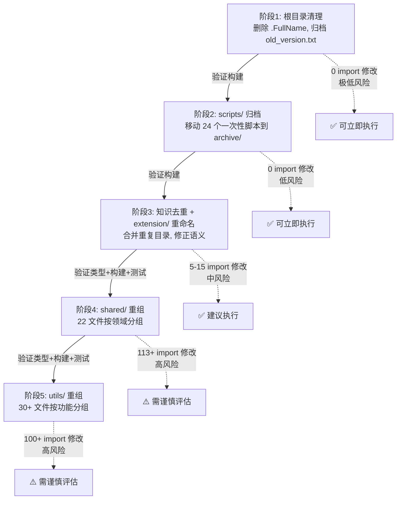

# Vertex Code 工程结构整理方案

> **执行状态更新（2026-07-09）**：阶段 1-4 已完成并验证通过。阶段 5（utils/ 重组）因 vitest mock 兼容性问题已回退，保持原结构。

## 一、现状分析

### 1.1 项目概览

Vertex Code 是一个 VSCode 扩展 monorepo 项目，使用 pnpm + turbo 管理，包含以下工作区：

| 工作区 | 路径 | 职责 |
|--------|------|------|
| `vertex` | `src/` | 扩展主包（esbuild 打包） |
| `@roo-code/vscode-webview` | `webview-ui/` | Webview 前端（vite 构建） |
| `@roo-code/types` | `packages/types/` | 共享类型定义（tsup 构建） |
| `@roo-code/core` | `packages/core/` | 核心库 |
| `@roo-code/ipc` | `packages/ipc/` | IPC 通信 |
| `@roo-code/build` | `packages/build/` | 构建工具 |
| `@roo-code/vscode-shim` | `packages/vscode-shim/` | VSCode API 模拟 |
| `@roo-code/config-*` | `packages/config-*/` | 共享配置 |

### 1.2 关键技术约束

> **⚠️ 重要：项目全部使用相对路径 import，未配置路径别名（tsconfig paths）。**
>
> 例如 `import { Package } from "../../shared/package"`。
>
> 这意味着任何文件移动都需要同步修改所有引用该文件的 import 路径。
> 经搜索，仅 `../../shared/` 前缀的 import 就有 **113 处**，加上 `../../utils/`、`../../api/` 等，总引用点预计 **500+ 处**。

### 1.3 识别出的结构问题

#### 问题 A：根目录杂乱（低风险）

| 文件 | 问题 | 建议 |
|------|------|------|
| `.FullName` | 内容仅 `-NoNewline`，疑似误创建的垃圾文件 | 删除 |
| `old_version.txt` | 918 行旧版代码，无实际用途 | 归档到 `docs/archive/` 或删除 |

#### 问题 B：scripts/ 目录充斥一次性脚本（低风险）

[`scripts/`](scripts/) 目录共 29 个文件，其中约 **20 个是一次性历史修复脚本**，已完成使命：

```
fix-all-syntax.js          fix-final-3files.js       fix-telemetry-final.js
fix-all-telemetry.js       fix-final.js               fix-telemetry-imports.js
fix-cline-provider-v2.js   fix-last5.js               fix-telemetry-orphans.js
fix-cline-provider.js      fix-orphaned-code.js       fix-telemetry-v2.js
fix-codex.js               fix-remaining-telemetry.js fix-test-files-v2.js
fix-remaining.js           fix-test-files.js          fix-webview-handler-final.js
fix-webview-handler-v2.js  fix-webview-handler.js     fix-webview-v3.js
delete-orchestrator.cjs    verify-roo-remaining.js
```

**保留的活跃脚本**（5 个）：
- `bootstrap.mjs` — 依赖安装引导
- `cleanup-telemetry.js` — 遥测清理
- `code-server.js` — code-server 安装
- `find-missing-i18n-key.js` — i18n 检查
- `find-missing-translations.js` — 翻译检查
- `install-vsix.js` — VSIX 安装

#### 问题 C：src/shared/ 杂乱无分类（高风险）

[`src/shared/`](src/shared/) 包含 **22 个不相关文件**平铺，涵盖 API 配置、数组工具、成本计算、模式定义、工具定义等完全不同的领域：

```
api.ts                      # API 处理器配置与类型
array.ts                    # 数组工具函数
checkExistApiConfig.ts      # API 配置检查
combineApiRequests.ts       # API 请求合并
combineCommandSequences.ts  # 命令序列合并
context-mentions.ts         # 上下文提及
core.ts                     # 核心常量
cost.ts                     # 成本计算
embeddingModels.ts          # 嵌入模型配置
experiments.ts              # 实验特性
getApiMetrics.ts            # API 指标
getMultiModelUsage.ts       # 多模型用量
globalFileNames.ts          # 全局文件名常量
language.ts                 # 语言格式化
modes.ts                    # 模式定义
package.ts                  # 包信息
parse-command.ts            # 命令解析
ProfileValidator.ts         # 配置验证
skills.ts                   # 技能类型
support-prompt.ts           # 支持提示
todo.ts                     # 待办类型
tools.ts                    # 工具定义
vsCodeSelectorUtils.ts      # VSCode 选择器工具
WebviewMessage.ts           # Webview 消息类型
utils/requesty.ts           # Requesty 工具
```

#### 问题 D：src/utils/ 杂乱无分类（高风险）

[`src/utils/`](src/utils/) 包含 **30+ 个工具文件**平铺，涵盖文件系统、路径、Shell、日志、配置等：

```
autoImportSettings.ts    config.ts              fs.ts              mcp-name.ts
commands.ts              countTokens.ts         git.ts             migrateSettings.ts
errors.ts                globalContext.ts       networkProxy.ts    object.ts
export.ts                json-schema.ts         outputChannelLogger.ts
focusPanel.ts            path.ts                pathUtils.ts       safeWriteJson.ts
shell.ts                 single-completion-handler.ts
storage.ts               tag-matcher.ts         text-normalization.ts
tiktoken.ts              tool-id.ts             tts.ts
vitest-verbosity.ts      WorkspacePathResolver.ts
logging/                 # 已分组的日志子目录
```

#### 问题 E：src/extension/ 命名不清（中风险）

[`src/extension/`](src/extension/) 仅含 1 个文件 `api.ts`，目录名 `extension` 与扩展入口 `extension.ts` 容易混淆，且无法表达其用途（API 导出层）。

#### 问题 F：core/prompts/sections/ 知识目录重复（中风险）

[`src/core/prompts/sections/`](src/core/prompts/sections/) 下存在两个内容重复的知识目录：

```
graphics-knowledge/
  index.json
  mobile-performance-analysis.md
  shadow-dpcf-pcss-stability.md

knowledge/
  index.json
  graphics/
    mobile-performance-analysis.md      # 与上面重复
    shadow-dpcf-pcss-stability.md       # 与上面重复
  general/
    mode-handoff-validation-pattern.md
```

`graphics-knowledge/` 和 `knowledge/graphics/` 内容重复，应合并。

#### 问题 G：core/ 与 services/ 职责边界模糊（高风险）

部分功能在两个目录间存在重叠或归属不清：
- `core/checkpoints/` 与 `services/checkpoints/` 都有 checkpoint 相关代码
- `core/context/` 与 `core/context-management/` 两个相邻目录处理上下文管理
- `core/context/context-management/` 嵌套层级过深

---

## 二、分阶段整理方案

按风险从低到高分为 5 个阶段，每个阶段可独立执行和验证。

### 阶段 1：根目录清理（极低风险）

**目标**：移除根目录垃圾文件，保持根目录整洁。

**操作**：
1. 删除 `.FullName`（垃圾文件）
2. 将 `old_version.txt` 移动到 `docs/archive/old_version.txt`

**验证**：`pnpm bundle` 构建通过

**影响范围**：0 个 import 修改

---

### 阶段 2：scripts/ 目录归档（低风险）

**目标**：将一次性历史修复脚本归档，保留活跃脚本。

**操作**：
1. 创建 `scripts/archive/` 目录
2. 将以下 24 个脚本移动到 `scripts/archive/`：
   - 所有 `fix-*.js`（21 个）
   - `delete-orchestrator.cjs`
   - `verify-roo-remaining.js`
   - `cleanup-telemetry.js`（如确认不再需要）
3. 保留活跃脚本在 `scripts/` 根目录：
   - `bootstrap.mjs`、`code-server.js`、`find-missing-i18n-key.js`、`find-missing-translations.js`、`install-vsix.js`

**验证**：`pnpm bundle` 构建通过

**影响范围**：0 个 import 修改（脚本不被 src/ 引用）

---

### 阶段 3：知识目录去重 + extension/ 重命名（中风险）

**目标**：消除重复的知识目录，重命名语义不清的目录。

**操作**：

#### 3.1 合并重复知识目录
1. 删除 `src/core/prompts/sections/graphics-knowledge/`（保留更完整的 `knowledge/` 结构）
2. 确认 `knowledge/graphics/` 下文件与被删目录内容一致
3. 更新引用 `graphics-knowledge/` 的代码中的路径

#### 3.2 重命名 src/extension/
1. 将 `src/extension/api.ts` 移动到 `src/api/index.ts`（合并到已有的 api 目录）
   - 或重命名为 `src/api/facade.ts` 如果与现有 `api/index.ts` 冲突
2. 更新所有引用 `../extension/api` 或 `../../extension/api` 的 import 路径

**验证**：`pnpm bundle` + `pnpm check-types` + `pnpm test`

**影响范围**：约 5-15 个 import 修改

---

### 阶段 4：src/shared/ 重组（高风险）

**目标**：将 `src/shared/` 22 个平铺文件按领域分组。

**建议的目录结构**：

```
src/shared/
├── api/                    # API 相关
│   ├── index.ts            # 原 api.ts（API 配置与类型）
│   ├── checkExistApiConfig.ts
│   ├── combineApiRequests.ts
│   ├── getApiMetrics.ts
│   ├── getMultiModelUsage.ts
│   └── cost.ts
├── modes/                  # 模式相关
│   ├── index.ts            # 原 modes.ts
│   └── ProfileValidator.ts
├── tools/                  # 工具相关
│   ├── index.ts            # 原 tools.ts
│   └── todo.ts
├── messaging/              # 消息相关
│   ├── WebviewMessage.ts
│   └── context-mentions.ts
├── experiments.ts          # 实验特性（保持原位）
├── models/                 # 模型配置
│   └── embeddingModels.ts
├── i18n/                   # 国际化相关
│   └── language.ts
├── package.ts              # 包信息（保持原位）
├── globalFileNames.ts      # 全局文件名（保持原位）
├── support-prompt.ts       # 支持提示（保持原位）
├── skills.ts               # 技能类型（保持原位）
├── parse-command.ts        # 命令解析（保持原位）
├── core.ts                 # 核心常量（保持原位）
├── vsCodeSelectorUtils.ts  # VSCode 选择器（保持原位）
├── utils/                  # 通用工具
│   ├── array.ts
│   ├── requesty.ts
│   └── combineCommandSequences.ts
└── string-extensions.d.ts  # 类型声明（保持原位）
```

**操作策略**：
1. 为每个移动的文件创建新位置
2. 使用全局搜索替换更新所有 import 路径
3. 保留 barrel export（`index.ts`）减少外部引用变更

**验证**：`pnpm check-types` + `pnpm bundle` + `pnpm test`

**影响范围**：约 113+ 个 import 修改（仅 `../../shared/` 前缀）

---

### 阶段 5：src/utils/ 重组（高风险）

**目标**：将 `src/utils/` 30+ 个平铺文件按功能分组。

**建议的目录结构**：

```
src/utils/
├── fs/                     # 文件系统
│   ├── index.ts            # 原 fs.ts
│   ├── path.ts             # 原 path.ts
│   ├── pathUtils.ts
│   ├── safeWriteJson.ts
│   ├── storage.ts
│   └── WorkspacePathResolver.ts
├── shell/                  # Shell 与命令
│   ├── shell.ts
│   ├── commands.ts
│   └── tag-matcher.ts
├── config/                 # 配置相关
│   ├── config.ts
│   ├── globalContext.ts
│   ├── autoImportSettings.ts
│   └── migrateSettings.ts
├── text/                   # 文本处理
│   ├── text-normalization.ts
│   ├── tool-id.ts
│   └── json-schema.ts
├── ai/                     # AI 相关
│   ├── countTokens.ts
│   ├── tiktoken.ts
│   └── single-completion-handler.ts
├── system/                 # 系统相关
│   ├── networkProxy.ts
│   ├── tts.ts
│   ├── errors.ts
│   ├── object.ts
│   ├── focusPanel.ts
│   ├── export.ts
│   ├── mcp-name.ts
│   └── vitest-verbosity.ts
├── logging/                # 已有，保持不变
└── outputChannelLogger.ts  # 保持原位
```

**验证**：`pnpm check-types` + `pnpm bundle` + `pnpm test`

**影响范围**：约 100+ 个 import 修改

---

## 三、执行策略与风险控制

### 3.1 通用执行原则

1. **每个阶段独立提交**：完成一个阶段后立即 `git commit`，便于回滚
2. **先移动文件，再批量修正 import**：使用 `search_files` 定位所有引用，再用 `apply_diff` 批量修改
3. **每阶段完成后必须验证**：
   - `pnpm check-types`（类型检查）
   - `pnpm bundle`（构建验证）
   - `pnpm test`（测试验证，至少核心测试通过）
4. **保留 barrel export**：对高频引用的模块（如 `shared/api`、`shared/tools`）保留 `index.ts` 聚合导出，减少外部变更

### 3.2 风险矩阵

| 阶段 | 风险等级 | import 修改量 | 回滚难度 | 建议执行 |
|------|---------|--------------|---------|---------|
| 1. 根目录清理 | 极低 | 0 | 极易 | ✅ 立即执行 |
| 2. scripts 归档 | 低 | 0 | 极易 | ✅ 立即执行 |
| 3. 知识去重+重命名 | 中 | 5-15 | 易 | ✅ 建议执行 |
| 4. shared/ 重组 | 高 | 113+ | 中 | ⚠️ 需谨慎 |
| 5. utils/ 重组 | 高 | 100+ | 中 | ⚠️ 需谨慎 |

### 3.3 不建议本次执行的重构

以下重构风险过高，建议后续单独评估：

- **core/ 与 services/ 职责重新划分**：涉及数百个文件和数千个 import，且 `core/` 内部模块（task、tools、prompts、webview 等）高度耦合，强行拆分风险极大
- **引入路径别名**：虽然能从根本上解决相对路径问题，但需要修改 tsconfig、esbuild 配置，并全量替换所有 import，属于独立的大型重构

---

## 四、推荐执行顺序



---

## 五、预期收益

| 阶段 | 收益 |
|------|------|
| 1-2 | 根目录和 scripts/ 整洁，消除历史包袱 |
| 3 | 消除重复目录，命名语义清晰 |
| 4-5 | `shared/` 和 `utils/` 按领域分组，新开发者能快速定位代码，降低认知负担 |

---

## 六、决策点

请审阅本方案后，告知希望执行的阶段范围：

- **方案 A**：仅执行阶段 1-2（低风险清理，不碰代码结构）
- **方案 B**：执行阶段 1-3（清理 + 中等风险结构调整）
- **方案 C**：执行阶段 1-5（完整重组，含高风险的 shared/utils 重构）
- **方案 D**：自定义范围（指定执行哪些阶段）
